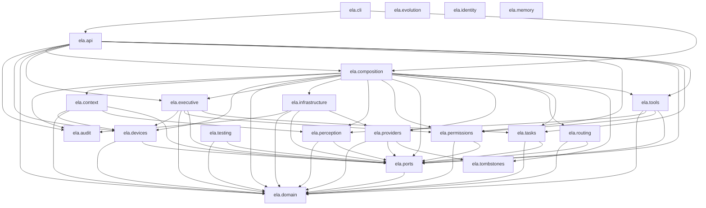
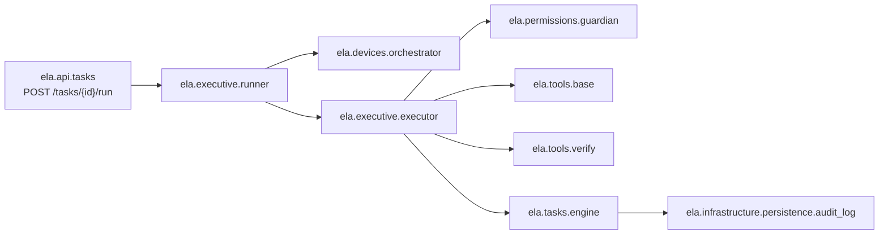

# Architettura di ELA — v0.1

Che cosa importa che cosa, quali bordi possono parlare con il mondo, e che strada fa una chiamata
dal `POST` all'effetto. Le decisioni stanno negli ADR (`docs/adr/`) e la fonte di verità è
`docs/spec/ELA_spec.md`: questo file è il **disegno di ciò che c'è**, non un altro posto dove
decidere.

**Due dei tre blocchi sono generati leggendo il codice**, con
`scripts/generate_architecture.py`, e `tests/docs/test_architecture.py` li riconfronta byte a byte
a ogni `make check`: se qualcuno aggiunge un import fra due package e non rigenera il diagramma, la
suite fallisce. **Il terzo è scritto a mano** e lo dichiara: non è ricavabile dagli import, perché
è una sequenza di chiamate e non una direzione di dipendenza. Di quello si verifica ciò che si
può — che ogni nome esista e che ogni freccia sia una strada che nel codice esiste davvero.

Il criterio, con le parole dell'utente che l'ha scelto: *«preferisco un diagramma onesto e parziale
a uno completo e a mano»*.

Per rigenerare:

```
uv run python scripts/generate_architecture.py
```

## 1. Il grafo dei package (generato)

Ogni package di `src/ela` e i package di `ela` che importa. Le direzioni che si vedono qui non
sono un'intenzione: sono gli import veri, e sono le direzioni che le 36 regole di architettura
(`tests/architecture/rules.py`, ADR 0002) impongono. Si legge dall'alto: `api` e `cli` sono i
bordi, `composition` è l'unico che nomina i concreti (regola 27, ADR 0023 §12), `domain` e `ports`
non importano nessuno — `domain` non importa nemmeno `ports` — e i quattro package ancora vuoti
(`context`, `evolution`, `identity`, `memory`) compaiono come nodi isolati, che è ciò che sono:
cartelle previste da §48 che v0.1 non ha riempito.

<!-- generato da scripts/generate_architecture.py: il grafo dei package -->



<!-- fine del blocco generato: il grafo dei package -->

## 2. I bordi che nominano una libreria di infrastruttura (generato)

Regola 3 (ADR 0002 §3): il Core non importa mai `anthropic`, `openai`, `httpx`, `sqlalchemy`,
`alembic`, `aiosqlite`, `fastapi`, `typer`, `uvicorn`. Quattro package possono, e sono i quattro
bordi del sistema: chi parla con un modello, chi parla con il disco, chi risponde a HTTP e chi
scrive sul terminale.

Questa tabella è **letta dal codice** — chi *nomina davvero* una di quelle librerie — e non
stampata da un elenco: `tests/docs/test_architecture.py` verifica poi che l'insieme così misurato
sia esattamente `INFRA_PACKAGES`, l'allowlist che la regola dichiara. Un quinto package che
importasse `httpx` comparirebbe qui e farebbe fallire quel confronto, che è l'ordine giusto delle
due cose: prima ciò che è vero, poi ciò che era permesso.

<!-- generato da scripts/generate_architecture.py: i bordi che nominano una libreria di infrastruttura -->

| Package | Librerie che nomina |
|---|---|
| `ela.api` | `fastapi`, `uvicorn` |
| `ela.cli` | `httpx`, `typer` |
| `ela.infrastructure` | `sqlalchemy` |
| `ela.providers` | `anthropic`, `httpx` |

<!-- fine del blocco generato: i bordi che nominano una libreria di infrastruttura -->

## 3. Il percorso di una chiamata (scritto a mano)

**Questo blocco non è generato.** Un grafo delle chiamate ricavato con l'AST su codice `async` con
iniezione di dipendenze è fragile, e un test fragile in `make check` costa più di quanto renda
(opzione scartata in `docs/milestones/M9.4.md`). Quindi è scritto, ed è dichiarato scritto.



Ciò che di questo blocco **è** verificato: che ogni modulo nominato esista, e che ogni freccia sia
una strada che nel codice esiste davvero — nella forma che la colonna «come» dichiara. Le tre
forme non sono un dettaglio di implementazione, sono l'architettura:

| Da | A | Come |
|---|---|---|
| `ela.api.tasks` | `ela.executive.runner` | composizione |
| `ela.executive.runner` | `ela.devices.orchestrator` | import |
| `ela.executive.runner` | `ela.executive.executor` | import |
| `ela.executive.executor` | `ela.permissions.guardian` | port `AuthorizingGuardianPort` |
| `ela.executive.executor` | `ela.tools.base` | port `ToolPort` |
| `ela.executive.executor` | `ela.tools.verify` | port `VerifierPort` |
| `ela.executive.executor` | `ela.tasks.engine` | import |
| `ela.tasks.engine` | `ela.infrastructure.persistence.audit_log` | port `AuditLog` |

- **import** — il modulo importa l'altro. È la forma più semplice e la meno interessante.
- **port `X`** — il chiamante importa un `Protocol` da `ela.ports` e non sa chi lo soddisfa; chi
  lo soddisfa lo fa **strutturalmente**, senza ereditare niente. L'executor non importa
  `ela.tools`: la freccia «executor → tool» è vera come chiamata e falsa come dipendenza, e dirla
  «arco di import» sarebbe mentire proprio dove l'architettura è più deliberata. Il test verifica
  che `X` sia un port dichiarato, che il chiamante lo importi, e che il modulo dall'altra parte
  definisca una classe che ha davvero tutti i membri del `Protocol` — `Tool` compresa, che
  dichiara `idempotent` come annotazione **senza valore**, perché un dubbio non deve leggersi come
  un sì (ADR 0015 §8, ADR 0021 §1).
- **composizione** — l'oggetto arriva dalla composition root: `ela.api` non costruisce niente
  (regola 27) e riceve un `Ela` già montato. Il test verifica che la classe dall'altra parte sia
  davvero un campo di `Ela` e che il chiamante prenda quell'oggetto.

Ciò che **non** è verificato, e va detto: che questa sia *la* sequenza, e che sia completa. Nessun
test si accorgerebbe di un passaggio dimenticato. È il prezzo dichiarato del terzo blocco.

## Dove sta il resto

- **Le decisioni**: `docs/adr/` — 27 ADR, dal primo sullo stack all'ultimo sulle esenzioni ritirate.
- **Le regole**, in codice: `tests/architecture/rules.py` (36 regole, ognuna con il suo caso
  negativo in `violations.py`) e i 13 contratti `import-linter` di `pyproject.toml`.
- **Che cosa v0.1 semplifica**: `docs/milestones/M9.4.md`, sezione «L'elenco di ciò che in v0.1 è
  semplificato». È l'elenco completo dei limiti dichiarati, con il rimando per ognuno.
- **La storia**: `docs/CHANGELOG.md`, una voce per milestone.
