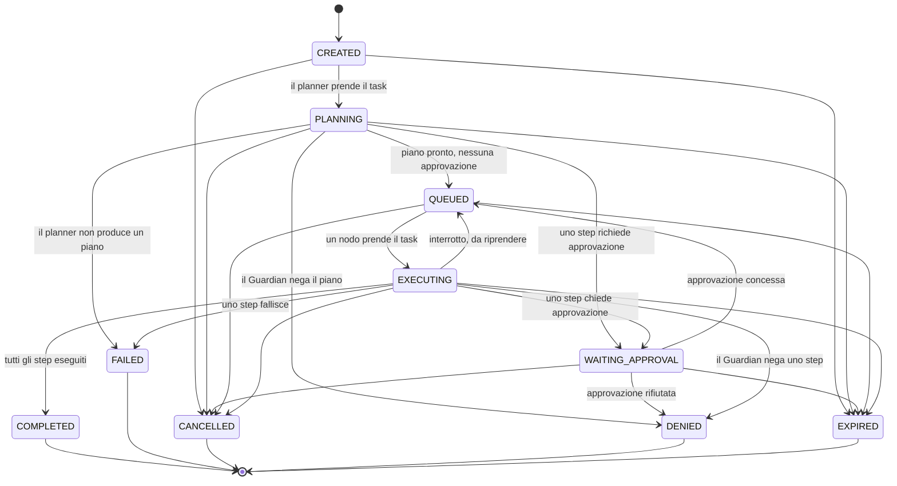

# 0004. Transizioni di stato del Task e forma della funzione `transition`

- **Stato:** Accettata
- **Data:** 2026-09-04
- **Riferimenti spec:** §14, §15, §17, §27, §33, §34, §51, §52, §62, §63, §65
- **Milestone:** M1.2

## Contesto

§14 elenca dieci stati del task e chiede due cose: che lo stato sia deterministico e che "le
transizioni illegali siano impossibili". §52 chiede che il rifiuto delle transizioni illegali sia
un test di architettura. Non dice però *quali* transizioni siano legali: la tabella va decisa, e
va decisa prima che esista il Task Engine (M3.x) che la userà, perché ogni componente successivo —
Guardian, Audit, persistenza, API — leggerà gli stati che questa tabella produce.

M1.1 ha lasciato `TaskState` come puro dato e ha fissato che un `Task` non si muta ma si
ricostruisce (ADR 0003 §8 e Conseguenze). M1.2 introduce l'unico punto del Core autorizzato a
cambiare lo stato di un `Task`: `ela.tasks.state_machine`. La tabella è stata proposta e approvata
in review il 2026-09-04 (`docs/milestones/M1.2.md`).

## Decisione

### 1. La tabella

Stati terminali, senza uscite: COMPLETED, FAILED, CANCELLED, DENIED, EXPIRED.

| Da \ A | PLANNING | WAITING_APPROVAL | QUEUED | EXECUTING | COMPLETED | FAILED | CANCELLED | DENIED | EXPIRED |
|---|:-:|:-:|:-:|:-:|:-:|:-:|:-:|:-:|:-:|
| **CREATED** | ✓ | | | | | | ✓ | | ✓ |
| **PLANNING** | | ✓ | ✓ | | | ✓ | ✓ | ✓ | ✓ |
| **WAITING_APPROVAL** | | | ✓ | | | | ✓ | ✓ | ✓ |
| **QUEUED** | | | | ✓ | | | ✓ | | ✓ |
| **EXECUTING** | | ✓ | ✓ | | ✓ | ✓ | ✓ | ✓ | ✓ |
| COMPLETED, FAILED, CANCELLED, DENIED, EXPIRED | | | | | | | | | |

23 transizioni legali su 100 coppie (stato, stato); 77 illegali: 10 auto-transizioni, 50 in
uscita dai terminali, 17 tra stati non terminali.



Il diagramma non è illustrativo: `tests/docs/test_adr_transitions.py` estrae gli archi da questo
blocco e li confronta con `TRANSITIONS` in `src/ela/tasks/state_machine.py`. Chi cambia uno dei
due senza l'altro rompe `make check`.

### 2. I principi che generano la tabella

Ogni riga discende da uno di questi principi, e ognuno è un test in
`tests/tasks/test_state_machine.py`. Modificare la tabella significa contraddire un principio, non
solo spostare una ✓.

- **P1 Terminali chiusi.** Da COMPLETED, FAILED, CANCELLED, DENIED, EXPIRED non si esce mai. Un
  task finito che riparte è un task nuovo, con un id nuovo e un `parent_id` che punta al vecchio.
- **P2 Nessuna auto-transizione.** `EXECUTING → EXECUTING` è illegale: un evento STATE_CHANGED che
  non cambia stato è rumore nel log e nasconde un bug del chiamante.
- **P3 CANCELLED ed EXPIRED da ogni stato non terminale.** L'utente deve poter fermare ELA in
  qualunque momento (§65), e un `deadline` può scadere in qualunque momento, anche a metà
  esecuzione.
- **P4 FAILED solo dove ELA sta lavorando:** PLANNING (il planner non produce un piano) ed
  EXECUTING (uno step fallisce). In CREATED, WAITING_APPROVAL e QUEUED non gira nulla che possa
  fallire; ciò che può succedere lì è essere cancellati o scadere.
- **P5 DENIED solo dove qualcuno decide:** PLANNING (il Guardian valuta il piano, §27),
  WAITING_APPROVAL (l'utente rifiuta), EXECUTING (il Guardian nega uno step al momento di
  eseguirlo, perché un'autorizzazione è scaduta o una policy è cambiata). Mai da CREATED, dove non
  c'è ancora una capability da valutare, né da QUEUED, dove non si decide nulla.
- **P6 Un solo ingresso in EXECUTING: QUEUED.** Dopo un'approvazione si torna in QUEUED, non
  direttamente in EXECUTING: è il Device Orchestrator (§17) a scegliere dove e quando riprendere.
- **P7 Un solo ingresso in COMPLETED: EXECUTING.** Nessuna scorciatoia PLANNING → COMPLETED: un
  task senza nulla da eseguire passa comunque per QUEUED → EXECUTING con zero step. §63 dice che
  eseguire non è dimostrare il successo; completare senza aver eseguito sarebbe peggio.
- **P8 Nessun vicolo cieco.** Ogni stato è raggiungibile da CREATED e ogni stato non terminale può
  raggiungere un terminale.

Due righe meritano una nota perché aprono cicli:

- **EXECUTING → QUEUED** è la base del trasferimento tra nodi (§15) e del "riprendere attività
  interrotte" di §14: un nodo che va offline non è un fallimento del task. Il task torna in coda e
  l'orchestratore lo riassegna; per l'utente "ELA sta eseguendo il rendering" resta vero.
- **EXECUTING → WAITING_APPROVAL** è §62 applicato per step: un piano con uno step ad alto rischio
  non deve chiedere tutto prima di iniziare, chiede quando arriva a quello step. È anche ciò che
  permette a §14 di "sapere quali autorizzazioni sono ancora necessarie".

### 3. La funzione `transition` produce l'evento, non lo riceve

La richiesta iniziale era `transition(task, new_state, event) -> Task` con la regola "ogni
transizione produce un TaskEvent". Le due frasi non stanno insieme alla lettera: se la funzione
ritorna solo il `Task`, l'evento non lo produce lei, lo riceve, e allora esistono due modi di
sbagliare: costruire un evento incoerente con la transizione, oppure validarlo e poi non
registrarlo.

Decisione (review 2026-09-04): **non deve poter esistere una transizione senza il suo evento**,
quindi è la funzione a costruirlo e a restituirlo insieme al task:

```python
def transition(
    task: Task,
    new_state: TaskState,
    *,
    event_id: TaskEventId,
    now: datetime,
    message: str = "",
    step_id: StepId | None = None,
    metadata: Mapping[str, JsonValue] | None = None,
) -> Transition:  # NamedTuple(task: Task, event: TaskEvent)
```

`event_id` e `now` arrivano dal chiamante perché il dominio non genera id e non legge l'orologio
(ADR 0003 §4): la funzione resta pura e deterministica, stessi input → stesso task e stesso
evento. L'evento è sempre `STATE_CHANGED` con `previous_state = task.state` e
`new_state = new_state`, coerente per costruzione. `message`, `step_id` e `metadata` sono i campi
di `TaskEvent` che il chiamante può voler riempire (quale step ha chiesto l'approvazione, quale
decisione ha negato): passano invariati.

Il task restituito è `task.model_copy(update={"state": new_state})`: cambia solo `state`, il task
in ingresso non viene toccato. Un `new_state` che non sia un membro di `TaskState` è rifiutato con
`TypeError` prima di consultare la tabella: `"QUEUED" == TaskState.QUEUED` è vero per uno
`StrEnum`, e `model_copy` non valida, quindi senza il controllo una stringa finirebbe dentro il
task. Fail-safe (§33): nel dubbio si rifiuta.

### 4. La state machine non ha politica

`transition` applica la tabella e nulla più. Non controlla `deadline`, non sa se un'approvazione è
stata concessa, non conosce il Guardian. Chi decide *se* un task è scaduto o *se* può partire è il
Task Engine (M3.x); qui si decide solo *se la mossa è legale*. Tenere separate le due domande è
ciò che rende la tabella verificabile in modo esaustivo: 100 coppie, 100 test.

### 5. `TaskState` resta puro dato

La tabella, `is_terminal`, `can_transition` e `allowed_transitions` vivono in
`ela.tasks.state_machine`. `TaskState` non riceve metodi: il dominio non ha comportamento
(CLAUDE.md, ADR 0003 §8), e un test verifica che l'enum non definisca attributi oltre ai membri.

### 6. Regola architetturale 5: lo stato cambia in un solo posto

Fuori da `ela.tasks.state_machine`, nessun modulo di `src/ela` cambia lo stato di un `Task`. La
regola è espressa come le regole 1–4 di ADR 0002: una funzione AST in
`tests/architecture/rules.py` (`check_state_changes`) che segnala

- `.model_copy(update={... "state": ...})` con un dizionario letterale che contiene la chiave
  `"state"`;
- `Task(..., state=<espressione>)` dove l'espressione non è `TaskState.CREATED`, l'unico stato in
  cui un task può *nascere*.

È una rete euristica, non una prova: lavora sui nomi, non sui tipi, e un alias di `Task` la
aggira. Lo si dichiara qui perché nessuno la scambi per una garanzia; la garanzia è la review. I
casi negativi in `tests/architecture/violations.py` dimostrano che intercetta il bypass ovvio, e
il caso `Task(..., state=TaskState.CREATED)` dimostra che non intralcia la creazione legittima.

### 7. La coverage al 100% dei moduli critici è un gate

`make check` include `cov-critical`: `pytest --cov=ela.tasks --cov-branch --cov-fail-under=100`.
Oggi il solo package critico esistente è `ela.tasks`; `ela.permissions` e `ela.audit` si
aggiungono al target quando avranno codice. Non ha un test negativo proprio: a fallire è
pytest-cov, non codice nostro.

## Alternative considerate

- **`transition(task, new_state, event: TaskEvent) -> Task`, con l'evento validato** — rispetta
  la firma richiesta, ma l'evento esiste prima della validazione e il chiamante può non
  registrarlo. "Produce" diventerebbe "richiede". Scartata per il motivo detto in §3.
- **Ritornare `tuple[Task, TaskEvent]`** — equivalente a `Transition`, ma `result.task` e
  `result.event` si leggono, `result[0]` e `result[1]` no.
- **PLANNING → COMPLETED** per i task che non hanno nulla da eseguire — contraddice P7: la
  differenza tra "non c'era nulla da fare" e "è stato fatto" deve restare visibile nel log.
- **WAITING_APPROVAL → EXECUTING** dopo un'approvazione — salterebbe il Device Orchestrator
  (P6); il nodo che stava eseguendo potrebbe non essere più quello giusto.
- **DENIED da CREATED** (rifiuto immediato per policy) — prima del piano non c'è una capability
  da valutare (§27: Planner → Capability → Guardian); un rifiuto per policy avviene in PLANNING.
- **DENIED da QUEUED** (autorizzazione revocata mentre il task è in coda) — la revoca si manifesta
  quando il Guardian rivaluta lo step al momento di eseguirlo: EXECUTING → DENIED copre il caso
  senza aprire una decisione in uno stato in cui nessuno decide.
- **Interruzione = FAILED e nuovo task** — perde la continuità di §15 e obbliga a duplicare il
  piano; EXECUTING → QUEUED è più semplice e più fedele.
- **EXECUTING → PLANNING** (ripianificazione dopo un fallimento, §34) — **non ammessa in v0.1**.
  Un fallimento porta in FAILED; se in futuro il Proactive Core dovrà ripianificare un task
  esistente invece di crearne uno figlio, sarà una riga aggiuntiva con un ADR dedicato, non un
  nuovo task. Nota lasciata qui apposta perché la scelta sia rivista alla luce di §34, non
  riscoperta.
- **Metodi su `TaskState`** (`TaskState.EXECUTING.can_go_to(...)`) — comodi, ma mettono
  comportamento nel dominio e spostano la tabella dove i test di architettura non la vedono.
- **Regola 5 come contratto import-linter** — impossibile: import-linter vede gli import, non le
  chiamate.

## Conseguenze

- `TRANSITIONS`, `TERMINAL_STATES`, `is_terminal`, `can_transition`, `allowed_transitions`,
  `transition`, `Transition` e `IllegalTransitionError` sono l'API pubblica di
  `ela.tasks.state_machine`. Il Task Engine (M3.x) la usa e non la aggira: la regola 5 lo verifica.
- Il diagramma Mermaid di questo ADR è verificato contro il codice; aggiornare la tabella significa
  aggiornare entrambi e questo ADR resta vero per costruzione.
- Ogni transizione produce esattamente un `TaskEvent` `STATE_CHANGED`; il log degli eventi di un
  task ricostruisce la sua storia di stati senza ambiguità (§14: "capire cosa è successo").
- `make check` fallisce se `src/ela/tasks/` scende sotto il 100% di branch coverage.
- Le decisioni di politica (scadenze, approvazioni, riprese) restano fuori da questo modulo: quando
  arriveranno (M3.x) si appoggeranno su `transition` e non la sostituiranno.
