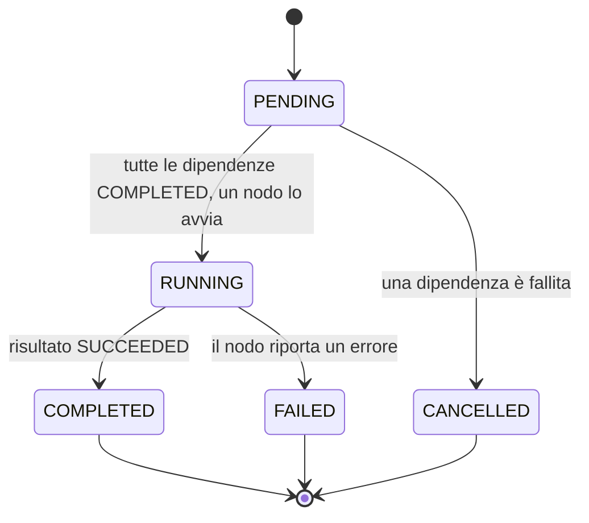

# 0009. Task Graph: DAG degli step, stato derivato dalla trail, operazioni per step, propagazione dei fallimenti

- **Stato:** Accettata. §7 "chi esegue decide": l'executor chiude ogni step che ha eseguito con `complete_step`/`fail_step` (ADR 0013 §1, §5); la scelta dello step successivo resta a M6.2. Prima decisione di chi esegue: una verifica fallita porta anche il **task** in FAILED, un risultato FAILED del tool no (ADR 0014 §4).
- **Data:** 2026-09-05
- **Riferimenti spec:** §13, §14, §15, §17, §32, §33, §51, §52, §63, §64, §65
- **Milestone:** M3.2

## Contesto

§15 chiede uno stato globale delle attività indipendente dal dispositivo: un task iniziato sul Mac
continua su Windows, si monitora da iPhone, si riprende dopo. §13 dà a ogni step del piano le sue
`dependencies`, ma fino a M3.1 quel campo era solo dato: nessuno lo validava, nessuno sapeva quali
step fossero eseguibili, nessuno registrava che uno step era finito. M1.1 aveva previsto
`STEP_STARTED`, `STEP_COMPLETED` e `STEP_FAILED` fra i `TaskEventType`; M3.1 (ADR 0008) ha reso il
piano un'entità persistita e ha fissato il percorso di scrittura dell'engine. Mancava il grafo: chi
dice che il piano è un DAG, in che ordine si esegue, cosa è pronto, cosa cade con un fallimento — e
dove vive lo stato di ogni step così che nessun nodo lo possieda. Le decisioni A–D sono
dell'utente (review del 2026-09-05, `docs/milestones/M3.2.md`).

## Decisione

### 1. Il grafo è degli step, non dei task

I nodi sono i `TaskStep` del piano e gli archi le loro `dependencies`. M3.2 non introduce figli
con `parent_id`: `create` continua a non accettarlo. Il retry di uno step fallito è uno step nuovo
o un task nuovo (ADR 0004 P1), non lo stesso step; la ripianificazione (§34) arriverà con la
milestone che ne avrà bisogno.

### 2. Lo stato di uno step è la piega della trail

`StepState` = PENDING, RUNNING, COMPLETED, FAILED, CANCELLED (enum in `ela.domain`, additivo). Non
esiste una tabella né una colonna: lo stato di ogni step si **piega** dagli eventi con `step_id`
della trail del task, `STEP_STARTED → RUNNING`, `STEP_COMPLETED → COMPLETED`, `STEP_FAILED →
FAILED`, `STEP_CANCELLED → CANCELLED` (membro nuovo di `TaskEventType`). Uno step mai nominato è
PENDING. La trail è persistita (`task_events`, ADR 0006) e appartiene al task, non al nodo: lo
stato del grafo è persistito e indipendente dal dispositivo per costruzione (§15). Nessuna
migrazione, nessun port nuovo. Una tabella di step resta la strada "il giorno che qualcosa dovrà
interrogarli in SQL" (ADR 0008 §2).

Una trail che contraddice la tabella di §3 — uno STEP_COMPLETED senza STEP_STARTED, uno `step_id`
fuori dal piano o assente — non si interpreta: `IllegalStepTransitionError` / `UnknownStepError`
(§33, come la state machine di M1.2).

### 3. Le transizioni di uno step

Quattro mosse legali, nessuna auto-transizione, tre stati terminali. RUNNING → CANCELLED non c'è:
uno step parte solo quando ogni dipendenza è COMPLETED, e COMPLETED è terminale, quindi nulla da
cui uno step in esecuzione dipende può fallire dopo; la propagazione tocca solo step PENDING.
`cancel`, `expire` e `fail` del **task** non toccano gli step: il task è terminale, il suo grafo
resta com'è, e ogni operazione di step su un task non EXECUTING è rifiutata senza scrivere
nulla (§33). Un risultato che un nodo riporta dopo un `cancel` o un `expire` del task non viene
quindi registrato dal sistema, ma non è perso: resta al nodo che lo ha prodotto. Come il nodo lo
gestisce — scarto, log locale — è protocollo dei nodi (M12), non dell'engine (review
2026-09-05). Il diagramma è confrontato con `STEP_TRANSITIONS` da `tests/docs/test_adr_graph.py`.

### 4. `TaskGraph`: validazione, ordine, eseguibili, propagazione

`ela.tasks.graph.TaskGraph` è puro e immutabile: importa solo stdlib, `ela.domain` e
`ela.tasks.errors`, ed è importabile da chiunque (l'orchestrator di M6.2 ne userà i tipi).
`TaskGraph.from_plan(plan)` rifiuta un id di step duplicato, una dipendenza su uno step fuori dal
piano o elencata due volte (`InvalidGraphError`) e un ciclo (`CyclicDependencyError`, con il ciclo
riportato; l'auto-dipendenza è un ciclo di lunghezza 1). `order` è l'ordine topologico di Kahn con
i pareggi rotti dall'ordine del piano: **deterministico**, e un piano già ordinato mantiene il suo
ordine. `ready(states)`: gli step PENDING con tutte le dipendenze COMPLETED, in ordine topologico.
`to_cancel(step, states)`: i discendenti ancora PENDING. `is_complete` (tutti COMPLETED, vero per
zero step: ADR 0004 P7) e `is_blocked` (esiste uno step FAILED o CANCELLED: il grafo non potrà
mai completarsi). Le invarianti che ne seguono sono property test su DAG casuali
(`tests/tasks/test_graph_properties.py`): ogni step RUNNING o COMPLETED ha le dipendenze
COMPLETED; ogni discendente di uno step FAILED o CANCELLED è CANCELLED; `ready` non contiene mai
un discendente di uno step fallito; uno scheduler greedy completa ogni DAG in al più `n` giri.

### 5. Le operazioni per step dell'engine

L'engine resta l'unico scrittore. `STEP_OPERATIONS` è la tabella, confrontata con quella qui
sotto da `tests/docs/test_adr_graph.py`; `tests/tasks/test_engine_table.py` verifica che ogni
riga sia legale in `STEP_TRANSITIONS` e che l'unione copra tutte e quattro le mosse.

| Operazione | Da | A | Evento | Audit | Chiave |
|---|---|---|---|---|---|
| `start_step` | PENDING | RUNNING | `STEP_STARTED` | `STEP_STARTED` | — |
| `complete_step` | RUNNING | COMPLETED | `STEP_COMPLETED` | `STEP_COMPLETED` | `result_id` |
| `fail_step` | RUNNING | FAILED | `STEP_FAILED` | `STEP_FAILED` | — |
| `cancel_step` | PENDING | CANCELLED | `STEP_CANCELLED` | `STEP_CANCELLED` | — |

Quattro membri nuovi di `AuditEventType`, un tipo per operazione (ADR 0008 §3). `cancel_step`
non ha un metodo pubblico: è la propagazione di `fail_step` (§6). Precondizioni comuni, tutte
rifiutate senza scrivere: task EXECUTING (`TaskEngineError`), step nel piano
(`UnknownStepError`), orologio non indietro (`ClockSkewError`, ADR 0008 §7). `start_step` esige
che lo step sia in `ready`; `complete_step` un `ExecutionResult` SUCCEEDED di quel task e di
quello step (§63). Percorso di scrittura, sotto il lock del task: `get` → `events` → `plan` →
controlli → `append_event` → `audit.append`; il task non viene salvato perché non cambia. Le
operazioni ritornano `GraphState(graph, states)`. Attore: ELA per ciò che il nodo riporta,
SYSTEM (`task-engine`) per le cancellazioni propagate, che nessuno ha chiesto (ADR 0008 §10).
`graph(task_id)` è la lettura corrispondente.

### 6. Propagazione e idempotenza per esito

`fail_step` scrive STEP_FAILED e il suo audit, poi per ogni step di `to_cancel` (in ordine
topologico) uno STEP_CANCELLED con `message="dependency <id> failed: <messaggio>"`,
`metadata={"operation": "cancel_step", "cause_step_id": …}` e un audit `STEP_CANCELLED`. Non c'è
unit-of-work (ADR 0006 §4): un crash a metà lascia dipendenti non cancellati. Perciò `fail_step`
su uno step già FAILED non è un no-op puro ma **riconcilia**: non scrive un secondo STEP_FAILED
e cancella ciò che manca. È l'unica operazione idempotente "per esito"; `start_step` è no-op per
stato e `complete_step` per stato e chiave (`result_id` nei metadata dello STEP_COMPLETED, regola
di ADR 0008 §8: stessa operazione e stessa chiave, altrimenti `TaskEngineError`).

### 7. Il task e il suo grafo

`complete(task_id, result)` riceve la guardia "ogni step del piano è COMPLETED" (ADR 0004 P7
"tutti gli step eseguiti", §63 "eseguire non è riuscire"): estende ADR 0008 §9. `fail_step`
**non** porta il task in FAILED: l'engine registra un fatto per operazione, e chi esegue (M5)
decide se fallire il task, chiedere un'approvazione o rimetterlo in coda, leggendo
`GraphState.is_blocked`. `plan()` valida il DAG prima di scrivere: un piano con ciclo o dipendenza
ignota non viene mai persistito. Il dominio resta dato: `TaskPlan` non valida (ADR 0003 §8), e un
piano scritto a mano nel repository con un ciclo fa sollevare `graph()` — lato sicuro, nessuno
step è eseguibile.

### 8. Interruzione

Se il task lascia EXECUTING (queue, approvazione, recovery) uno step RUNNING resta RUNNING nella
trail; il nodo che riprende chiama `start_step` (no-op) ed esegue. Il cambio di nodo non è
registrato a livello di step: limite dichiarato, da chiudere in M6.2 se l'orchestrator lo vorrà
(sarebbe una riga RUNNING → PENDING, con un ADR).

### 9. Regola architetturale 11: gli eventi di step li scrive solo `ela.tasks`

Lo stato del grafo è la piega degli eventi STEP_*: chi ne costruisse uno fuori dall'engine
cambierebbe lo stato di uno step senza i controlli del grafo e senza audit. Regola AST
closed-world `check_step_event_writers` in `tests/architecture/rules.py`: fuori da `ela.tasks`
segnala `TaskEvent(... event_type=TaskEventType.STEP_*)` o `event_type="STEP_*"`. È euristica
sui nomi come la regola 5; un test lega il prefisso `STEP_` all'insieme esatto di `STEP_EVENTS`.
Nessun contratto import-linter: `graph.py` resta importabile.

## Alternative considerate

- **Tabella `task_steps` con colonna `state`**, port `TaskRepository.step_states`/`save_step_state`,
  migrazione — interrogabile in SQL, ma duplica ciò che la trail già dice, aggiunge un port e una
  migrazione per uno stato che nessuno interroga ancora in SQL; ADR 0008 la rinviava "quando
  servirà". Scartata dall'utente.
- **Ogni step come sottotask** con `parent_id`, stato = `TaskState` del figlio, propagazione =
  `engine.cancel` — riusa tutto ma richiede un campo `Task.step_id` (migrazione) e confonde step e
  task: una `Approval` è già legata a `task_id` + `step_id`. Scartata dall'utente.
- **Solo il modulo puro, scritture in M5** — senza uno scrittore "stato persistito" e "dipendenti
  in CANCELLED con motivo" restano sulla carta. Scartata dall'utente.
- **`fail_step` che fallisce anche il task** (ADR 0004: "EXECUTING → FAILED: uno step fallisce") —
  due fatti in un'operazione, e preclude a M5 riprese e retry decisi con cognizione. Scartata
  dall'utente.
- **Propagazione derivata e non scritta** ("bloccato" come stato calcolato) — non lascia nel log il
  *motivo* per cui uno step non è mai partito (§32).
- **RUNNING → CANCELLED** — per l'invariante di §3 non serve; aggiungerla aprirebbe la domanda
  "chi ferma il nodo che sta eseguendo", che è dell'orchestrator.
- **Validare il DAG nel dominio** (validator pydantic su `TaskPlan`) — è comportamento, e il
  dominio non ne ha (ADR 0003 §8).
- **`cancel_step` pubblico** — nessuno lo chiede in v0.1; una cancellazione voluta dall'utente
  ferma il task (§65), non un singolo step.

## Conseguenze

- `STEP_TRANSITIONS`, `STEP_EVENTS`, `TERMINAL_STEP_STATES`, `TaskGraph`, `GraphState`,
  `StepStates`, `can_step_transition` sono l'API pubblica di `ela.tasks.graph`; `STEP_OPERATIONS`,
  `StepOperation`, `graph`, `start_step`, `complete_step`, `fail_step` quella dell'engine;
  `GraphError`, `InvalidGraphError`, `CyclicDependencyError`, `UnknownStepError`,
  `IllegalStepTransitionError` gli errori. Il gate `cov-critical` copre `graph.py` al 100%.
- Il diagramma di §3 e la tabella di §5 sono verificati contro il codice; cambiare uno dei due
  senza il codice rompe `make check`.
- `TaskEventType.STEP_CANCELLED`, `StepState` e quattro membri di `AuditEventType` in più:
  additivi, nessuna migrazione (ADR 0003 §7).
- Ogni operazione di step legge il piano e l'intera trail: cresce con gli heartbeat (già
  dichiarato in ADR 0008). La piega è lineare negli eventi.
- La cascata senza unit-of-work e lo step RUNNING che sopravvive all'interruzione sono limiti
  dichiarati (§6, §8).
