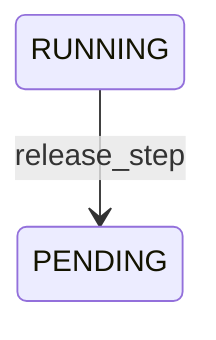

# 0038. Il protocollo del lavoro: la chiamata al tool fatta da lontano, e il tempo che decide per chi tace

- **Stato:** Accettata. SPEC di M12.2 approvata dall'utente il 2026-09-11, con le decisioni D1–D20
  della Fase 12 come vincoli ereditati; riconciliata lo stesso giorno con `main` dopo il merge di
  M12.1 (`5649c8a`), con quattro risposte dell'utente: l'id dell'assegnazione nel corpo, il 412
  nella storia 5 della suite, lo spegnimento che sveglia chi aspetta, la sensibilità del task in
  una migrazione sua.
- **Data:** 2026-09-11
- **Riferimenti spec:** §11, §14, §15, §16, §17, §20, §27, §32, §33, §56, §57, §63
- **Continua:** ADR 0005 §2-bis; ADR 0008 §5, §6, §8, §11, §12; ADR 0009 §8; ADR 0011 §9; ADR 0012
  §5; ADR 0013 §6, §9; ADR 0014 §3; ADR 0015 §5, §8; ADR 0016 §3, §6; ADR 0017 §3, §4, §7, §8;
  ADR 0018; ADR 0019 §3, §5, §8, §10; ADR 0021 §1, §2; ADR 0023 §3, §7, §9, §10; ADR 0026 §2, §3,
  §5, §7, §10; ADR 0029 §6; ADR 0030 §15, §17; ADR 0031 §6; ADR 0035 §6; ADR 0036 §11; ADR 0037
  §4, §11, §12, §13.
- **Estende:** ADR 0002 (cinque regole nuove, dalla 48 alla 52), ADR 0005 (un port nuovo,
  `AssignmentStore`, e `VerifierPort` che dichiara `reads_the_machine`), ADR 0009 (la riga
  RUNNING → PENDING), ADR 0017 §4 (il filtro F7, `UNVERIFIABLE`), ADR 0019 §10 (`ASSIGNED`), ADR
  0023 §3 (tre variabili), ADR 0037 §4 (tre rotte che un nodo può chiamare). **Rivede ADR 0017 §8
  per il task** (§16).

## Contesto

Fino a M12.2 il ciclo di esecuzione di ELA è **una riga**: `executive/runner.py:219` chiama
`self._executor.execute(task_id, step_id, placement=placement)` e aspetta, nello stesso processo,
qualunque nodo il piazzamento nomini. M12.1 ha dato a un nodo remoto un'identità provabile e l'ha
tenuto lontano dal lavoro con due fatti — nessun nodo remoto può essere `LOCAL_ONLY` (D18) e ogni
task è `LOCAL_ONLY` — e il rifiuto `PRIVACY` (D19). Questo ADR è quella riga spezzata in due.

L'obiettivo, con le parole della spec (`docs/milestones/M12.2.md`):

> **Un nodo che non è questo processo riceve una chiamata a `Tool.execute` con i suoi argomenti,
> la esegue e ne riporta l'esito; tutto ciò che decide resta sul Core — il Guardian, il `consume`,
> la riga `STARTED`, la verifica, la chiusura dello step. E quando il nodo tace, decide il tempo:
> l'assegnazione scade, e lo step torna in gioco se nessuno può aver agito, si chiude
> `interrupted` se qualcuno può.**

La domanda «il nodo c'è ancora?» aveva una risposta sola, l'heartbeat (ADR 0016 §3), che riguarda
il **nodo**. Con un lavoro affidato altrove ne serve una seconda, che riguarda **il lavoro**: non
«il nodo è vivo?» ma «il lavoro che gli ho dato è stato preso, e riportato, in tempo?». La prima è
una credenza che invecchia; la seconda è un confronto fra due istanti. La frase che dà
all'assegnazione la sua ragione di esistere è di D6: **il momento in cui un nodo è «sparito» è la
scadenza dell'assegnazione, un fatto di tempo passato.**

Il criterio di fine: *un nodo finto esegue il contratto per intero — si arruola, chiede lavoro,
esegue, riporta, tace, torna tardi, torna in due, viene revocato a metà — e le tre implementazioni
reali, M12.3–M12.5, si misureranno contro la suite di conformità che nasce qui* (§18).

## 1. Le decisioni della fase, e che cosa vincolano qui

Le venti decisioni stanno in `docs/milestones/M12.1.md`, § «Le decisioni della Fase 12» (ADR 0037
§1). Questo ADR non le riapre.

| Etichetta | Che cosa vincola in M12.2 |
|---|---|
| D1 | la linea è `Tool.execute` (§2); l'esito si ricostruisce (§4) |
| D2 | l'entità, il suo produttore, il suo consumatore e la suite nascono insieme |
| D3 | il filtro legge un tetto che il nodo non ha scritto (§16) |
| D4 | la presa è una richiesta del nodo; il long-poll degrada in polling (§11) |
| D5 | ogni rotta del lavoro sa chi chiede; nessuna prende un id di nodo dalla richiesta (§11) |
| D6 | la misura, «§15 oggi è onorato da un tool su otto» (§8) |
| D7 | la chiave della riconsegna è l'id dell'assegnazione, coniato dal Core (§12) |
| D8 | l'assegnazione è un'entità, con port, contract test e migrazione; ADR 0026 intatto (§5) |
| D9 | `MISSING_TRAIT` non entra: l'unica capability che accende un sensore non viaggia (§14) |
| D10 | le tre rotte del lavoro stanno dietro il middleware (§11) |
| D11 | `STEP_RELEASED` nasce con il suo scrittore (§8) |
| D12 | chi dichiara la sensibilità di un task è l'identità risolta (§16) |
| D13 | una consegna da un nodo revocato è il 401 di M12.1 (§12) |
| D14 | la `STARTED` nasce alla presa (§2, §8) |
| D15 | una capability il cui verifier legge la macchina non viaggia (§14) |
| D16 | una presa per nodo, con una condizione sulla scadenza (§7) |
| D17 | la revoca è una scadenza immediata (§15) |
| D18 | la sensibilità del task contro il tetto del nodo, e le quattro risposte di §57 (§16) |
| D19 | il ramo remoto prima della sensibilità del task, nell'ordine dei commit (§17) |
| D20 | `Task.max_privacy`, e il livello nella domanda di un'approvazione (§16) |

## 2. La linea di D1 in codice

La pipeline di `Executor.execute` resta com'è fino al `consume` compreso. **Poi il percorso si
divide per id** (§3): per `local` il tool gira nel processo, come prima; per un nodo remoto
l'executor scrive un'assegnazione e ritorna. Il resto accade in tre istanti diversi:

| Dove | Che cosa |
|---|---|
| **Core prima** (dentro `run`) | le righe 1–12 di sempre — il task, il grafo, lo step, gli argomenti dello step, `ensure_placed`, le approvazioni, il grant, il Guardian, il `consume` — poi `Assignments.assign`, e `run` ritorna `ASSIGNED` |
| **Core alla presa** (dentro la richiesta del nodo che chiede lavoro) | `Assignments.claim`, la `STARTED` di un tool non ripetibile, `SENSOR_ACTIVATED` se la capability ne accende uno — oggi mai per un nodo remoto (§14) — e l'ordine come risposta |
| **Nodo** | `tool.execute(decision, arguments)`: la sola riga che attraversa la rete |
| **Core dopo** (dentro la richiesta del nodo che consegna) | il cancello, l'esito ricostruito, `results.add`, `DELIVERED`, `TOOL_EXECUTED`, la verifica, la chiusura dello step |

La linea di D1 passa letteralmente per `executor.py:874`. **La seconda metà ha
un'implementazione sola**: le scritture dopo il tool sono un metodo privato che il percorso locale
chiama dopo `_run_tool` e la consegna chiama dopo aver ricostruito l'esito; la riparazione dopo un
crash resta `_resume`. L'executor guadagna tre metodi pubblici, e nessuno chiama `.execute(`
(regola 16 intatta):

| Metodo | Quando | Che cosa fa |
|---|---|---|
| `begin(assignment_id, device_id)` | alla presa | `Assignments.claim`, poi la `STARTED` e `SENSOR_ACTIVATED` per il nodo dell'assegnazione |
| `deliver(assignment_id, device_id, envelope)` | alla consegna | il cancello, l'esito ricostruito (§4), poi la seconda metà |
| `finish(task_id, step_id)` | quando un'assegnazione scaduta ha lasciato qualcosa, o quando lo step di una consegnata è rimasto RUNNING | le righe 1–5 e 7 senza `ensure_placed` — qui non gira nessun tool — e poi `_resume` o `_interrupted`; né un esito né una `STARTED` è `ExecutorError`, perché lo step andava rilasciato |

## 3. `local` resta nel processo, e «questo processo» è un id

Un piano che gira qui resta com'è: `local` è eseguito nel processo, e solo un nodo remoto passa
dall'assegnazione (dec. A, forma A1). Farci passare anche `local` vorrebbe un lavoratore nel
processo, cioè un ciclo in background, contro ADR 0019 §3 («`run` ritorna, non dorme») e ADR 0023
§9 («Niente in background, nessun loop»).

**Il criterio è l'id**: in-process se e solo se il nodo scelto è `LOCAL_DEVICE_ID`. Non `network`,
che è un dato del registro e un componente del punteggio: l'id di `local` è l'unico deterministico
del sistema **perché è questa macchina** (ADR 0016 §4), e ogni altro lo conia il Core (D5).

Il difetto di due strade è quello che ADR 0031 ha combattuto per le macchine di CI: due percorsi
che dovrebbero dire la stessa cosa e divergono in silenzio. Si evita condividendo tutto tranne il
trasporto, e misurandolo: un test di parità esegue lo stesso piano su `local` e su un nodo finto e
confronta le due sequenze di tipi di evento, **uguali**.

## 4. L'esito che torna: una busta, e il risultato lo conia il Core

`Tool.execute` restituisce un `ExecutionResult` con `id`, `created_at` e `duration_ms` coniati
dall'orologio e dall'`IdGenerator` del tool — su un nodo remoto, **del nodo** — e `TOOL_EXECUTED`
prende `created_at` dal risultato: con l'orologio del nodo, l'ordine della catena di §32 verrebbe
da fuori. Quindi il nodo consegna una **busta**, e il Core ne ricostruisce il risultato (D1, D7).

La busta ha **tre forme**, perché `_run_tool` ha tre esiti:

| Forma | Quando | Che cosa ne fa il Core |
|---|---|---|
| `result` | il tool ha risposto, `SUCCEEDED` o `FAILED` | ricostruisce il risultato, poi la seconda metà |
| `refused` | il tool ha rifiutato la decisione — scaduta al suo orologio, per esempio | `fail_step` con `tool.refused`; nessun risultato nello store, come in locale |
| `exception` | il tool ha sollevato; porta il nome del tipo, mai il messaggio (§57) | un FAILED `tool.exception` coniato dal Core, come in locale |

Ciò che dice il nodo e ciò che il Core sa già:

| Campo del risultato | Da dove | Perché |
|---|---|---|
| `id` | il Core: `uuid5(DELIVERY_NAMESPACE, str(assignment.id))` | è la chiave dello store; deterministico, ripara da sé la finestra A8; la forma di `AUTHORIZATION_NAMESPACE` |
| `created_at` | il Core, all'istante del cancello | D1: il tempo dal proprio `Clock` |
| `task_id`, `step_id`, `capability_id`, `tool_name`, `device_id`, `decision_id`, `authorization_id` | l'assegnazione e il registro dei tool del Core | la busta non li porta, e un campo in più è `422` |
| `STARTED_ID` in `metadata` | lo store dei risultati | la `STARTED` l'ha scritta il Core alla presa |
| `status` | il nodo | solo `SUCCEEDED` e `FAILED`, gli unici che `Tool.execute` produce |
| `output`, `error`, `usage` | il nodo | la parola del tool, come oggi |
| `duration_ms` | il nodo, come dato riportato | il Core misurerebbe la rete |
| gli istanti del nodo | il nodo, in `metadata["node"]` | un dato riportato, non un istante della catena |

**Una decisione fabbricata non ha dove entrare.** Un nodo può eseguire un tool sulla propria
macchina quando vuole — la macchina è sua. Ciò che non può è far registrare al Core un effetto che
il Core non ha assegnato: un esito si accetta solo contro un id di assegnazione coniato dal Core,
per il nodo autenticato, in stato `CLAIMED`; la busta non porta decisioni. L'entità la conia
l'executor e nessun modulo di `ela.api`: è la regola 52.

## 5. L'assegnazione: un insieme di campi, un insieme di stati, una scadenza

`Assignment`, in `ela.domain`, validata in costruzione:

| Campo | Tipo | Perché c'è |
|---|---|---|
| `id` | `AssignmentId` | la chiave della riconsegna (D7), mai derivata: un ripiazzamento ne conia una nuova |
| `created_at` | `UtcDatetime` | l'orologio del Core |
| `task_id`, `step_id` | `TaskId`, `StepId` | di chi è il lavoro, e il rimando agli argomenti |
| `device_id` | `DeviceId` | il nodo a cui il lavoro è affidato: il fatto, non il giudizio (ADR 0026 §2) |
| `decision` | `PermissionDecision` | la metà della chiamata, una volta sola, con il suo id dentro |
| `authorization_id` | `AuthorizationId \| None` | il grant che il `consume` ha speso |
| `state` | `AssignmentState` | `OFFERED`, `CLAIMED`, `DELIVERED`, `EXPIRED` |
| `expires_at` | `UtcDatetime` | la scadenza corrente, una colonna sola |
| `claimed_at` | `UtcDatetime \| None` | l'istante della presa, da cui si misura il tetto |
| `delivered_at`, `delivery_digest` | `UtcDatetime \| None`, `str \| None` | la consegna accettata e l'impronta della busta |

```
OFFERED ──claim──▶ CLAIMED ──deliver──▶ DELIVERED
   │                  │  ▲
   │                  │  └─renew (sposta expires_at)
   └──expire──▶ EXPIRED ◀──expire──┘
```

`state` e non `status`, perché è una macchina di transizioni. `OFFERED` e non `PENDING`, che è la
parola di uno step: il rilascio mette nella stessa frase «lo step torna PENDING» e «l'assegnazione
scade». `DELIVERED` e non `SETTLED`: nell'executor «settle» significa già un esito che salda una
`STARTED`.

**Una colonna di scadenza.** Ogni istruzione che decide — la presa, la scadenza, «una per nodo», il
cancello della consegna — chiede «è scaduta?» con **un** significato. Con due colonne ogni
predicato sceglierebbe la colonna secondo lo stato, e un predicato che sceglie quella sbagliata è un
difetto che nessun test di forma vede. La scadenza dell'offerta non si perde: è
`min(created_at + ttl, decision.expires_at)`, e la decisione è nella riga.

Invarianti: la decisione è `ALLOWED`, di quello step, con una scadenza; **un'offerta non sopravvive
alla sua decisione** (`expires_at <= decision.expires_at`, e nessuna presa) — il tool ricontrolla
la decisione all'inizio della chiamata, non durante; il lavoro in mano è stato preso a un istante;
`delivered_at` e `delivery_digest` vanno insieme, e solo per `DELIVERED`.

**Gli argomenti: rimandati allo step, non copiati.** L'executor chiama il tool con gli argomenti
dello step, «belong to the plan, not to the caller» (ADR 0018), e il piano è immutabile: quindi
`(assignment.decision, step.arguments)` **è** la chiamata, e l'ordine li legge dallo step alla
presa. Copiarli aggiungerebbe un posto dove il contenuto dell'utente vive (§57), senza aggiungere un
fatto. La decisione nella riga è un titolo al portatore (ADR 0011 §9) scritto su disco: chi legge
il database può ripresentarla entro la sua scadenza a un tool della propria macchina — cosa che con
il database in mano potrebbe fare comunque. Non è una difesa che si perde.

**Il TTL, un metro solo per il silenzio.** `ELA_ASSIGNMENT_TTL_SECONDS`, default 120, misura sia
l'attesa di una presa sia l'attesa di un segno del lavoro preso: la domanda è una — quanto aspetta
il Core prima di decidere che il nodo è sparito — e due variabili farebbero di D6 due fatti con due
tarature. La ragione del numero, non una misura: il doppio del TTL dell'heartbeat, e sotto i 300 s
della decisione. Le scadenze: all'offerta `min(now + ttl, decision.expires_at)`; alla presa
`now + ttl`; al rinnovo `min(now + ttl, claimed_at + max)`. Tutte chiuse (ADR 0005 §2-bis: la sua
lista guadagna questa voce).

Port introdotti:

| Port | Spec | Modalità | Membri |
|---|---|---|---|
| `AssignmentStore` | §15 | async | `add`, `get`, `for_step`, `offered_to`, `claim`, `deliver`, `renew`, `expire`, `cut_short` |

**La migrazione `0009`** fa nascere la tabella, con l'indice unico parziale di §7; reversibile, con
il suo test di downgrade. Nessuna colonna per gli argomenti.

Tabella nuova:

| Tabella | Colonne |
|---|---|
| `assignments` | `seq`, `id`, `created_at`, `task_id`, `step_id`, `device_id`, `decision`, `authorization_id`, `state`, `expires_at`, `claimed_at`, `delivered_at`, `delivery_digest` |

## 6. Il servizio, e perché si passa da lì

**La scadenza si legge, e si scrive solo da chi agisce.** È ADR 0016 §3 applicato a una seconda
scadenza: il port restituisce la riga com'è scritta — `OFFERED` anche quando è scaduta — e il
servizio `ela.executive.assignments.Assignments` la restituisce com'è adesso. Nessuno sweeper.
`EXPIRED` si scrive con un `UPDATE` condizionale da chi agisce su quella scadenza, nella stessa
istruzione che la verifica.

**Tutto passa dal servizio**: assegnare, reclamare, consegnare, rinnovare, far scadere. `ela.api`
riceve il servizio e non l'adapter, e nessun modulo fuori dal servizio nomina il port (regola 48).

| Verbo | Chi lo chiama | Che cosa scrive |
|---|---|---|
| `assign` | l'executor, nel ramo remoto, dentro `run` | heartbeat del task, poi la riga `OFFERED`; prima di scrivere, `ensure_placed` e la decisione `ALLOWED`, di quello step, non scaduta |
| `standing` | il runner, su uno step RUNNING | niente: l'ultima assegnazione dello step, com'è adesso |
| `next_for` | la rotta della presa | niente: l'offerta viva più vecchia per quel nodo |
| `claim` | `Executor.begin`, sotto il lock del task | heartbeat, poi `OFFERED → CLAIMED` condizionale |
| `deliver` | `Executor.deliver` | `CLAIMED → DELIVERED` condizionale, con l'impronta |
| `held` | `Executor.deliver`, il cancello | la riga per id, la sola lettura che il cancello chiede |
| `describe` | il runner, per la ragione di `ASSIGNED` | la frase che nomina nodo, lavoro e scadenza |
| `renew` | la rotta del rinnovo | heartbeat, poi la scadenza spostata, condizionale |
| `lapse` | il runner, su un'assegnazione scaduta | `EXPIRED` condizionale; poi il rilascio, oppure niente e il runner chiama `Executor.finish` |
| `cut_short` | la rotta della revoca | le scadenze vive del nodo portate a `now` |
| `reject` | le rotte della consegna e del rinnovo | `DEVICE_REJECTED` con i motivi della via del lavoro |

Le istruzioni sul port hanno la forma di `consume` (ADR 0012 §5): la sicurezza sta nell'`UPDATE`, e
se nessuna riga cambia una lettura nella stessa transazione dà il nome all'errore. La scadenza copre
anche un'assegnazione reclamata: un `CLAIMED` scaduto che restasse dentro l'indice per step
bloccherebbe il ripiazzamento.

## 7. Una per step, e una per nodo alla volta

**Per step: un indice unico parziale**, `(task_id, step_id) WHERE state <> 'EXPIRED'`, nella forma
di `0007`. Qui l'indice va bene, perché fra una scadenza e la nuova assegnazione dello stesso step
c'è sempre la scrittura di `EXPIRED`.

**Per nodo: una condizione sulla scadenza, non un indice** (D16). Un indice non conosce il tempo: un
`CLAIMED` scaduto e non ancora marcato bloccherebbe il nodo. La presa è un'istruzione sola:

```sql
UPDATE assignments
   SET state = 'CLAIMED', claimed_at = :now, expires_at = :expires_at
 WHERE id = :id AND device_id = :device AND state = 'OFFERED' AND expires_at > :now
   AND NOT EXISTS (SELECT 1 FROM assignments AS held
                    WHERE held.device_id = :device AND held.state = 'CLAIMED'
                      AND held.expires_at > :now)
```

**L'atomicità poggia sullo scrittore unico di SQLite, ed è dichiarata**: il `NOT EXISTS` e
l'`UPDATE` sono un'istruzione, che SQLite esegue sotto il suo lock di scrittura. Su un motore con
scrittori concorrenti servirebbe un lock sulla riga del nodo. La prova è con due connessioni vere e
una barriera, e con un adapter ingenuo che la stessa prova fa vincere due volte.

Perché una alla volta: per task ce n'è comunque al più una, il runner è sequenziale; con una presa
per nodo «il nodo tace» ha un oggetto solo. Il prezzo: un'offerta a un nodo occupato può scadere
prima che il nodo si liberi, con un `DEVICE_SELECTED` per ogni `run`.

## 8. Quando l'assegnazione scade

`Assignments.lapse` scrive `EXPIRED` e guarda i risultati dello step:

| Nello store per lo step | Che cosa vuol dire | Che cosa succede |
|---|---|---|
| niente | senza `STARTED` non è girato niente (D14) | **`release_step`**: lo step torna PENDING, con chiave l'id dell'assegnazione, e `place()` sceglie di nuovo |
| una `STARTED` senza esito | qualcuno può aver agito | `Executor.finish` → `_interrupted`: `execution.interrupted`, `retryable`, il nodo della `STARTED` (ADR 0021 §2) |
| un esito | la consegna era arrivata, e il processo è morto dopo averla scritta | `Executor.finish` → `_resume`, dalla prima scrittura mancante |

**La misura di D6, esatta.** La `STARTED` nasce alla presa e solo per un tool non ripetibile.
Quindi: **mai reclamata ⇒ si ripiazza, per qualunque tool**; **reclamata e scaduta** ⇒ un tool non
ripetibile si chiude `interrupted`, uno ripetibile si ripiazza. Fra le capability che possono
viaggiare (§14) l'unico tool ripetibile è `core.echo`: `workspace.write_note` è idempotente su una
macchina sola, e non viaggia. Con le parole dell'utente: **«§15 oggi è onorato da un tool su
otto.»** Il giorno in cui il verifier della nota girerà sul nodo, il predicato della `STARTED`
rilascerebbe una nota reclamata e la scriverebbe su una seconda macchina: D6 andrebbe scritta come
un secondo predicato, e un test che appunta l'insieme dei tool ripetibili che viaggiano costringe a
rileggere questo paragrafo.

**Il rilascio: RUNNING → PENDING, con un ADR, e l'ADR è questo.** ADR 0009 §8 l'aveva nominata:
«sarebbe una riga RUNNING → PENDING, con un ADR». ADR 0009 non si riscrive; la riga, l'arco e
l'operazione stanno qui, e i test leggono l'unione.



| Operazione | Da | A | Evento | Audit | Chiave |
|---|---|---|---|---|---|
| `release_step` | RUNNING | PENDING | `STEP_RELEASED` | `STEP_RELEASED` | `assignment_id` |

`release_step` è idempotente **per chiave**, letta nella trail e non nello stato: dopo il rilascio
lo step torna RUNNING con il ripiazzamento, e un secondo rilascio con la stessa chiave non deve
rilasciarlo di nuovo. L'engine non conosce i tool né i risultati, quindi non sa se uno step va
rilasciato: la guardia sta nel servizio, che rilascia solo uno step per cui lo store non ha niente,
ed è per questo che `release_step` ha un chiamante solo (regola 50). Il servizio non chiama
l'executor: `lapse` restituisce ciò che ha fatto, e quando non ha rilasciato è il runner a chiamare
`Executor.finish`.

Niente di ciò che il runner sa diventa falso: lo step ripreso è PENDING, non RUNNING, e ADR 0019 §5
(«uno step RUNNING non viene ri-piazzato») resta vero com'è scritto. Per uno step RUNNING **senza**
assegnazione — lasciato così da un'approvazione, la finestra R8 — resta `confirm`: la domanda se
rilasciarlo è scritta qui per il primo nodo vero.

## 9. `recover()` non si tocca

`recover()` fallisce `orphaned` un task EXECUTING il cui ultimo `TaskEvent` è più vecchio di
`orphan_after`. **Ogni scrittura che fissa `expires_at` — `assign`, `claim`, `renew` — legge `now`,
calcola la scadenza, scrive un `HEARTBEAT` del task e solo dopo la riga.** Sia `t_h` l'istante
dell'heartbeat: `expires_at <= now + ttl <= t_h + ttl`. Per un'assegnazione viva a un istante `n`,
`n < expires_at <= t_h + ttl`, quindi `n - last_seen < ttl`; e l'avvio rifiuta
`ELA_ASSIGNMENT_TTL_SECONDS >= ELA_TASK_ORPHAN_AFTER_SECONDS`. Quindi `_is_orphan` non può essere
vero: la proprietà regge per costruzione, e la regola 48 la rende una proprietà del codice e non una
promessa. Con la riga prima dell'heartbeat, una morte fra le due lascerebbe una presa viva senza il
suo segno di vita. Ciò che non copre, e non deve: un'assegnazione scaduta senza che nessuno chiami
`run` — oltre `orphan_after` vince `recover()`, il verso fail-safe.

## 10. `RunOutcome.ASSIGNED`

Un esito, non uno stato del task: §14 fissa i dieci stati, e `ASSIGNED` è l'esito di **una
chiamata**, come `WAITING_DEVICE`. La tabella di ADR 0019 §10 non si riscrive; questa si legge in
unione con quella.

| `RunOutcome` | Quando | Il task e lo step |
|---|---|---|
| `ASSIGNED` | uno step è stato affidato a un nodo remoto e non è tornato | il task resta EXECUTING, lo step RUNNING |

La ragione è dell'assegnazione, non del runner: il runner continua a non scrivere nulla di suo, e
`Run.reason` porta la frase del servizio — il nodo, l'assegnazione, la scadenza. Uno step RUNNING
con un'assegnazione non si conferma con `confirm`, che guarda la disponibilità derivata
dall'heartbeat: si **legge**. Viva ⇒ `ASSIGNED`; scaduta ⇒ `lapse`; consegnata ⇒ `Executor.finish`.

La terminazione senza contatore si riscrive e non si allenta: *ogni iterazione che non ritorna
chiude uno step o ne rilascia uno, e il rilascio avviene al più una volta per step per chiamata*.

## 11. Le rotte del lavoro

| Metodo | Percorso | Identità | Che cosa fa |
|---|---|---|---|
| `POST` | `/nodes/work` | un nodo | chiede lavoro: tiene la richiesta fino a `ELA_NODE_POLL_SECONDS`, e se un'offerta per questo nodo è presa restituisce l'ordine (`200`), altrimenti `204` |
| `POST` | `/nodes/work/result` | un nodo | consegna la busta, con `assignment_id` nel corpo |
| `POST` | `/nodes/work/renew` | un nodo | rinnova il lavoro preso, con `assignment_id` nel corpo |

Le rotte che un'identità di nodo può chiamare passano da due a cinque: la tabella di ADR 0037 §4 e
questa, lette in unione; `NODE_ROUTES` in `api/security.py` guadagna le tre righe. Il token del Core
su queste rotte riceve lo stesso 401, perché il Core non è un nodo.

**L'id dell'assegnazione viaggia nel corpo** (l'utente, 2026-09-11). `NODE_ROUTES` è un insieme di
coppie (metodo, percorso) letterali, e il middleware confronta il percorso concreto: con l'id nel
percorso un nodo avrebbe ricevuto 401 e il token del Core sarebbe arrivato al handler, mentre due
test di M12.1 — la matrice di `test_security.py` e `test_the_core_is_not_a_node` — sarebbero
rimasti verdi. Insegnare i template al middleware sarebbe stata «una difesa che sembra attiva».
Nel corpo, il middleware non si tocca e ADR 0037 §4 — «nessun id nelle rotte del nodo» — resta vero
alla lettera. Nessuna rotta prende un id **di nodo** dalla richiesta: il nodo è l'identità risolta.

**L'ordine** ha esattamente queste chiavi: `assignment_id`, `capability_id`, `tool_name`,
`decision`, `arguments`, `expires_at`. Niente condizioni di successo, niente verifier: D1, «e
nient'altro». Lo compone un solo modulo, che non importa un client di rete (regola 51), e il
compositore solleva se l'identità che chiede non è quella dell'assegnazione.

**Il long-poll** rilegge dal servizio a intervallo fisso, `WORK_REREAD_INTERVAL`, un secondo, e
ritenta la presa. Non un canale in memoria svegliato dall'executor: sarebbe uno stato del trasporto
nella memoria di un processo, e legherebbe `ela.executive` a `ela.api`. Degrada in polling da sé:
se la connessione cade o la risposta è `204`, il nodo richiede. La latenza è l'intervallo di polling
(D4). `ELA_NODE_POLL_SECONDS`, default 25, tetto 60.

**Lo spegnimento sveglia chi aspetta** (l'utente, 2026-09-11). Fra una rilettura e l'altra il
long-poll attende su un evento; allo spegnimento l'evento si alza, chi aspetta risponde `204` e
chiude, e il nodo riprova. **Misurato prima di scriverlo**, con uvicorn 0.52.4 e un handler che
attende tre secondi: il lifespan scatta **dopo** l'attesa delle richieste in volo — il `Server`
chiude le prese, aspetta le connessioni, e solo allora manda `lifespan.shutdown` —, quindi con il
`Server` di prima il handler finiva la sua attesa (la risposta a 3,56 s, il segnale a 1,00 s); con
il gestore del segnale che alza l'evento il handler risponde all'istante del segnale e il server si
ferma in 0,12 s. Quindi l'evento lo alza **il gestore del segnale**: `api/server.py` costruisce il
`Server` e ne estende `handle_exit` — il metodo che uvicorn installa con `signal.signal` — perché
alzi l'evento con `call_soon_threadsafe`. Il middleware non si tocca. Non il lifespan, che
arriverebbe a richieste già finite; non un timeout di spegnimento: «interrompere un handler che può
essere avvisato è lo strumento sbagliato».

**La presa e la consegna prendono il lock del task**, il `set` di `app.state.running`: una presa,
una consegna e un `run` sullo stesso task sono tre chiamanti dell'executor sullo stesso step, e
l'executor non ha un lock suo. Con il lock occupato la presa salta quella rilettura e la consegna
riceve **409** senza scrivere niente: un «non adesso», per cui il nodo tiene la busta (D7). Il
rinnovo non lo prende: le sue scritture sono un `HEARTBEAT` e un `UPDATE` condizionale.

Errori aggiunti, nella forma della tabella di ADR 0023 §10:

| Caso | Eccezione | Stato |
|---|---|---|
| una consegna dopo la scadenza del lavoro | `AssignmentExpiredError` | `410` |
| una consegna per un task che si è chiuso | `AssignmentVoidError` | `410` |
| un lavoro che questo nodo non tiene: ignoto, di un altro, non più preso | `WorkNotYoursError` | `404` |
| una mossa che la riga non ammette — un rinnovo di un'offerta | `AssignmentNotUsableError` | `404` |
| un rinnovo al tetto | `AssignmentAtCapError` | `409` |
| una seconda busta dove una è stata accettata | `DeliveryConflictError` | `409` |

`AssignmentRefusedError` **non è in tabella**: `assign` rifiuta dentro il cammino — dopo il Guardian
e il `consume` —, e nessuna richiesta che un chiamante possa fare lo produce, perché il cammino
arriva a `assign` solo con una decisione `ALLOWED` appena fatta per un nodo che non è questa
macchina. Una riga così sarebbe una mappatura che nessun test può attraversare, cioè una porta
aperta e non una difesa; quei rifiuti si provano dove sono decisi.

I due `404` hanno **la stessa frase**, non solo lo stesso stato: un nodo che distinguesse «ignoto»
da «di un altro» potrebbe mappare le assegnazioni degli altri, ed è la ragione per cui ADR 0023 §7
risponde 401 e non 404 a un percorso inesistente. La differenza sta nell'audit, dove legge l'utente.

**La sequenza della presa**: `claim` → la `STARTED`, se il tool non è ripetibile → `SENSOR_ACTIVATED`
→ l'ordine. La presa prima della `STARTED`: una morte fra le due lascia una presa senza `STARTED`,
un ordine che non è uscito, e alla scadenza si rilascia (A4).

## 12. La consegna: idempotente, tardiva, altrui, revocata

La chiave è l'id dell'assegnazione (D7). Un solo istante serve il cancello e le scritture, la forma
di ADR 0013 §6. L'ordine delle scritture: per `result` ed `exception`, `results.add` (id
deterministico) → `DELIVERED` → la seconda metà; per `refused`, `fail_step` → `DELIVERED`. Così vale
sempre: *`DELIVERED` ⇒ l'esito è nello store, oppure lo step è già chiuso*.

| Caso | Risposta | Audit |
|---|---|---|
| prima consegna | `200` | gli eventi di sempre |
| replica identica, stessa impronta | `200`, la stessa; se una morte ha lasciato scritture mancanti, le completa | nessuno: una rete che ritenta non è un'azione |
| replica diversa | `409` | `DEVICE_REJECTED` `delivery_conflict` |
| tardiva, scaduta a `now` | `410` | `DEVICE_REJECTED` `late`, con lo stato riportato |
| task chiuso mentre il nodo lavorava | `410` | `DEVICE_REJECTED` `task_closed`, con lo stato riportato |
| non tua, id ignoto o altrui | `404` per entrambi | `DEVICE_REJECTED` `not_assigned`; il payload distingue ignoto da altrui |
| da un nodo revocato | `401`, dal middleware | `DEVICE_REJECTED` `revoked`, scritto da M12.1 e non rifatto qui |

Un ritorno tardivo si rifiuta — accettarlo farebbe della scadenza di D6 un fatto che dipende da chi
è passato di lì — **ma il fatto che porta resta**: se il tool non era ripetibile lo step è già
chiuso `interrupted`, «whether it acted is unknown», e il nodo che torna **sa** che ha agito. Il
`DEVICE_REJECTED` porta lo stato riportato, mai l'`output`; lo step non si riapre. L'impronta è lo
SHA-256 della busta canonica, nella riga dell'assegnazione: mai in un evento, mai in un errore.

**Chi scrive `DEVICE_REJECTED`**: il registro, per i quattro motivi d'identità di M12.1
(`Rejection`, `devices/registry.py`); il servizio, per i quattro della via del lavoro, che hanno un
vocabolario loro in `ela.executive.assignments`. Un tipo, due scrittori. L'attore è `SYSTEM`, come
M12.1 l'ha fissato, con un id suo, e il nodo nel payload come `named_device_id`.

## 13. Il rinnovo, e il tetto

Un tool che lavora più del TTL rinnova. Il rinnovo sposta la scadenza a
`min(now + ttl, claimed_at + max)` e scrive un `HEARTBEAT` sul task; non si audita — un segno di
vita non è un'azione. Ha un tetto, «No TTL without a cap»: al tetto `409`, e l'assegnazione scade
quando dice. Rinnovare un'offerta è `404`, come una non tua; una scaduta è `410`.

Variabili aggiunte, nella forma della tabella di ADR 0023 §3:

| Variabile | Tipo | Default | Vincolo |
|---|---|---|---|
| `ELA_ASSIGNMENT_TTL_SECONDS` | `int` | `120` | `0 <` ttl `<= ELA_DECISION_TTL_SECONDS`; `<` `ELA_TASK_ORPHAN_AFTER_SECONDS`; `<=` `ELA_ASSIGNMENT_MAX_SECONDS` |
| `ELA_ASSIGNMENT_MAX_SECONDS` | `int` | `3600` | `0 <` max `<= 86400`: il tetto di un lavoro preso |
| `ELA_NODE_POLL_SECONDS` | `int` | `25` | `0 <` poll `<= 60`: quanto una richiesta di lavoro resta aperta |

## 14. La verifica di un effetto remoto, e le capability che non viaggiano

Il vincolo, con le parole dell'utente (D15): «finché il verifier non gira dove l'effetto è avvenuto,
quella capability non viaggia — e quando girerà lì, si fiderà del nodo, che è il limite di D1.»
Riletti gli otto verifier, la divisione non è per rischio né per idempotenza: è **che cosa leggono**.

| Capability | Il verifier legge | Da lontano prova | Da lontano non prova | Legge la macchina |
|---|---|---|---|---|
| `core.echo` | l'output contro gli argomenti | tutto ciò che provava | niente di nuovo | `False` |
| `model.complete` | l'output e la rotta ricalcolata dal router del Core | che il provider che il nodo dice è quello che la policy prescrive | che la chiamata sia andata davvero lì | `False` |
| `voice.speak` | il testo descritto e `spoken_seconds` | che il nodo ha descritto il testo chiesto | che il tempo sia vero | `False` |
| `voice.speak_online` | la stessa classe della voce | che il nodo ha descritto il testo chiesto | che il tempo sia vero | `False` |
| `workspace.write_note` | il disco del Core | niente | tutto — e una nota con lo stesso percorso nella workspace del Core sarebbe **un falso positivo** | `True` |
| `perception.capture_screen` | lo store del Core | niente | tutto | `True` |
| `perception.read_screen_text` | lo store del Core | niente | tutto | `True` |
| `perception.listen` | lo store del Core | niente | tutto | `True` |

**Quattro capability viaggiano, quattro no.** Il nodo macOS di M12.3 fa eco, modello e voce,
dichiarato. Per quelle che viaggiano «la parola del tool» diventa «la parola del nodo», dichiarato
con un test ciascuna.

**La forma: una dichiarazione sul verifier e un rifiuto d'idoneità.** Il verifier dichiara
`reads_the_machine` **senza default** — la forma di `Tool.idempotent` — e il registro rifiuta un
verifier muto: dimenticarla non deve leggersi come un no. L'orchestratore riceve il registro dei
verifier come un port, ne deriva un requisito, e un nodo che non è `local` per un requisito così è
rifiutato con **`UNVERIFIABLE`**, il settimo rifiuto, nato con la sua resa (ADR 0035 §6). Un rifiuto e
non una restrizione dei candidati: la ragione deve arrivare a chi aspetta. ADR 0014 §3 — «Un'azione
che non può essere verificata non viene eseguita» — è applicato nella sola forma che il repository
ammette: non si esegue lì.

| # | Filtro | Regola | Rifiuto | Perché |
|---|--------|--------|---------|--------|
| F7 | verifica | `device.id == LOCAL_DEVICE_ID or not requirements.verified_here` | `UNVERIFIABLE` | D15; ADR 0014 §3: un effetto il cui verifier legge questa macchina non si esegue su un'altra |

Port estesi:

| Port | Spec | Modalità | Membri |
|---|---|---|---|
| `VerifierPort` | §63 | async | `reads_the_machine` |

**D9: che cosa non entra.** `MISSING_TRAIT` non entra: l'unica capability con `activates_sensor` è
`perception.listen`, che non viaggia. Un criterio che provasse `MISSING_TRAIT` su un nodo remoto
affermerebbe ciò di cui non ha costruito le precondizioni.

## 15. La revoca è una scadenza

Con D4 il Core non spinge: alla richiesta successiva il nodo revocato riceve 401. Per il lavoro che
aveva, D17: **scadenza immediata**, letterale — la revoca porta a `now` la scadenza di ogni
assegnazione viva del nodo, l'offerta compresa, che D17 non nomina ma che un nodo revocato non può
più prendere. `cut_short` la chiama la rotta della revoca **dopo** `registry.revoke`, anche sul ramo
«già revocato»: una morte fra le due scritture si ripara ripetendo `ela node revoke`. Da lì vale la
scadenza di sempre: la revoca non ha un ramo suo, ed è il punto.

## 16. La sensibilità del task

**Lo stato di partenza.** Solo `local` riceve lavoro: `run` non passa mai `max_privacy`, il default
è `LOCAL_ONLY`, e il filtro rifiuta un nodo più largo. È il default sicuro; «il difetto è che
nessuno PUÒ dichiararla». Il confronto di F2 non cambia: cambia da dove viene il valore di destra.

**Dove il task porta la sua sensibilità (D20).** `Task.max_privacy: PrivacyLevel = LOCAL_ONLY`,
**dichiarato alla creazione, immutabile**. Il runner smette di prenderla come argomento e la legge
dal task; `place` e `confirm` restano come sono. Il nome è lo stesso da un capo all'altro — corpo di
`POST /tasks`, campo, argomento di `place`, chiave del payload di `DEVICE_SELECTED`. La colonna nasce
con la migrazione `0010`, con `server_default` `LOCAL_ONLY`: i task di prima restano a casa.

**ADR 0017 §8 è rivisto per il task, apertamente.** Il suo titolo è «La privacy richiesta è un
argomento, non un campo nuovo del dominio», e il campo nuovo è proprio la privacy richiesta: una
distinzione non regge — §8 non parla di preferenze, quelle sono §2. La ragione, con le parole
dell'utente: **«§8 fece della sensibilità un argomento del chiamante e l'unico chiamante che esiste
non poteva passarlo — un argomento che nessuno può fornire è un campo senza scrittore, stessa
famiglia di `PROVIDER_CALLED`.»** Il corpo di §8 resta vero alla lettera: `TaskStep` non ha un campo
`privacy`, e `place` prende il valore come argomento. ADR 0017 non si riscrive.

Colonne aggiunte:

| Tabella | Colonne |
|---|---|
| `tasks` | `max_privacy` |

**Le quattro risposte di §57**, nella forma di ADR 0030 §17 (il provider, qui, è un nodo):

| Domanda | Risposta |
|---|---|
| **Quale nodo** | uno, quello che l'assegnazione nomina: un id coniato dal Core, autenticato dal suo segreto a ogni richiesta; l'ordine esce solo come risposta alla richiesta di quel nodo (regola 51) |
| **Quale tipo di dati** | gli argomenti di uno step, per una capability, e la decisione che lo permette; nessun altro step, nessun risultato precedente, nessun artefatto |
| **Perché viene inviato** | perché l'orchestratore ha scelto quel nodo per quello step: `DEVICE_SELECTED` è nell'audit con i punteggi, i rifiuti di ogni candidato e il `max_privacy` del task |
| **Quale policy lo consente** | due, entrambe dell'utente, confrontate in un punto solo: il tetto del nodo, imposto all'enrollment, e la sensibilità del task, dichiarata alla nascita; nessuna delle due la scrive il nodo, nessuna un modello |

**Chi la alza, come, e che cosa vede.** Solo l'utente, attraverso il token del Core, l'unica
identità che raggiunge `POST /tasks`; chi crea task senza l'utente li crea al default. `ela task
create --privacy TRUSTED`; allargare un task esistente non esiste, si crea un task nuovo. Vede il
livello in `TASK_CREATED` (nel sommario quando non è il default), in `GET /tasks/{id}`, in ogni
piazzamento — e **nella domanda di ogni approvazione** di un suo step. «Alzare» è il verso di
`PRIVACY_ORDER`: lascia andare il contenuto più lontano.

**La sensibilità nella domanda — G2 applicato al luogo** (D20). Per un task più largo di
`LOCAL_ONLY`, la domanda di un'approvazione porta una clausola che nomina il livello, dietro lo
stesso « — » degli argomenti dichiarati e separata da «; »:

```text
core.echo_stated for step … (…) — purpose: …; this task may run on a TRUSTED node: <reason>
model.complete for step … (…) — this task may run on a CLOUD_ALLOWED node: <reason>
```

Per un task `LOCAL_ONLY` la domanda è quella di prima, byte per byte. La clausola nomina **il
livello, non il nodo**: il livello è immutabile, il piazzamento no. Si compone in `Executor._ask` dal
task che l'executor legge già; `prompt_arguments`, `check_capability` e il catalogo non cambiano,
perché la sensibilità non è un argomento.

## 17. La garanzia di M12.1 che smette di valere, e l'ordine dei commit

Non c'è un filtro da togliere (D19). «Un nodo remoto non riceve mai lavoro» lo tengono D18 e
`PRIVACY`, perché ogni task è `LOCAL_ONLY`; smette di valere nel commit in cui un task può
dichiararsi più largo. L'orchestratore sceglie fra tutti i nodi e il runner eseguiva qui qualunque
nodo il piazzamento nominasse: un commit con la sensibilità del task e senza il ramo remoto farebbe
dire all'audit che un tool è girato altrove mentre è girato qui. Quindi **il ramo remoto viene
prima della sensibilità del task, e quell'ordine è un criterio di accettazione**, il 32 della spec:
un test di guardia nel commit della sensibilità, e una verifica commit per commit prima del push.
Fra i due commit il ramo remoto si prova con l'argomento di `run` che esisteva già, e che la
produzione non passa.

Il vincolo dichiarato di ADR 0037 — «**Un nodo remoto non riceve lavoro fino a M12.2**» — è
**saldato** da questo ADR, nella forma che ADR 0029 ha usato per ADR 0028 §9; la sua voce resta in
ADR 0037, che non si riscrive.

## 18. La suite di conformità

In `tests/conformance/`: **due** nodi finti in-process, *A* e *B*, che parlano con l'app vera
attraverso il trasporto ASGI di `httpx`, su un database SQLite vero, con il `FakeClock` del Core. Si
arruolano davvero, con i codici di M12.1, e annunciano con `If-Match` leggendo l'`ETag` (ADR 0037
§9). Tredici storie, ognuna valida per **qualunque** implementazione: arruolati e riporta; non
chiedere mai; taci; torna tardi; torna in due — con i due cloni che annunciano alla stessa revisione,
uno vince e l'altro riceve 412 e `DEVICE_IDENTITY_CONFLICT`; chiedete insieme; consegna due volte;
consegna ciò che non è tuo; vieni revocato a metà; lavora più del TTL; il Core muore a metà; un task
non dichiarato non ti arriva; ciò che si verifica solo qui non ti arriva.

**È il contratto che M12.3–M12.5 aspettano, non un test in più.** Le storie sono scritte una volta
contro un `NodeDriver` — un `Protocol` — e parametrizzate sui driver: ogni implementazione aggiunge
il suo, e la suite è la stessa. Un driver per un nodo vero dichiara la macchina che gli serve con uno
`skipif` (ADR 0031 §6). Una storia che un driver non sa recitare non si salta con un `if`: il driver
la dichiara in una mappa `UNSUPPORTED` con la ragione, la suite ne fa uno skip visibile, e un test
appunta la mappa per driver. Per il driver finto la mappa è vuota.

**Che cosa la suite non può provare**, nella forma di `tests/foreign_machine.py`: è un processo solo
e un event loop solo; non c'è rete, né Tailscale, né un intermediario che chiude un long-poll; il
tempo è il `FakeClock` del Core, nessuna deriva di un orologio di nodo; nessun TCC, nessun microfono,
nessuna chiave; la busta sopravvive al riavvio del nodo solo quanto il driver la fa sopravvivere;
dove un nodo tiene il segreto non passa per HTTP; uno Shortcut non si guida da `pytest`. Verde qui
significa che il Core e il nodo finto dicono la stessa cosa del contratto; verde con il driver di un
nodo vero, sulla sua macchina, è quello che conta.

## 19. Le finestre di crash

Ordine delle scritture. **In `run`**: … `PERMISSION_DECIDED` → [`consume`] → heartbeat →
`store.add` → ritorno `ASSIGNED`. **Alla presa**: heartbeat → `store.claim` → [`STARTED`] →
[`SENSOR_ACTIVATED`] → risposta. **Alla consegna**: cancello → `results.add` → `store.deliver` →
`TOOL_EXECUTED` → … (le finestre 8–9a di ADR 0015 §8); per `refused`, cancello → `fail_step` →
`store.deliver`. **Al rinnovo**: heartbeat → `store.renew`. **Alla scadenza**: `store.expire` →
`release_step` | `Executor.finish`. **Alla revoca**: `registry.revoke` → `cut_short`.

| # | Il processo muore dopo… | …e prima di | Stato che resta | Retry |
|---|---|---|---|---|
| A1 | `engine.heartbeat` (dentro `assign`) | `store.add` | un `HEARTBEAT` in più, nessuna assegnazione, step RUNNING, grant forse speso | il `run` successivo non trova assegnazioni, conferma il nodo e rifà la prima metà; il segno di vita in più non afferma niente di falso. **Non riparato, innocuo.** |
| A2 | `store.add` | il ritorno di `run` | un'offerta viva | il `run` successivo la trova viva e ritorna `ASSIGNED`. **Riparato.** |
| A3 | `engine.heartbeat` (dentro la presa) | `store.claim` | un `HEARTBEAT` in più, l'offerta intatta | il nodo richiede, e la presa riesce. **Riparato.** |
| A4 | `store.claim` | la `STARTED` | una presa senza `STARTED`: l'ordine non è uscito | alla scadenza `lapse` non trova niente e rilascia, anche per un tool non ripetibile. **Riparato.** |
| A5 | la `STARTED` | la risposta al nodo | una presa con `STARTED`, l'ordine non uscito | alla scadenza `interrupted`: il Core non distingue questa riga dalla A6, e l'esito non si inventa. **Dichiarato**: il verso che chiude uno step che forse non ha agito. |
| A6 | la risposta `200` della presa | la ricezione da parte del nodo | presa e `STARTED`: non si sa se l'ordine è arrivato | se è arrivato il nodo esegue e consegna; se no, alla scadenza `interrupted`, o il rilascio per `core.echo`. **Dichiarato, non riparabile.** |
| A7 | il cancello della consegna | `results.add` | niente scritto | il nodo, che tiene la busta, ritenta. **Riparato.** |
| A8 | `results.add` | `store.deliver` | l'esito nello store, l'assegnazione `CLAIMED` | il nodo ritenta: lo stesso id, lo stesso contenuto, e si prosegue; se non ritenta, alla scadenza `lapse` trova l'esito e `Executor.finish` riprende. **Riparato.** |
| A9 | `store.deliver` | `TOOL_EXECUTED` | assegnazione consegnata, esito nello store, audit senza | la replica del nodo o il `run` successivo chiamano `Executor.finish`, dalla prima scrittura mancante. **Riparato.** |
| A10 | `fail_step` con `tool.refused` | `store.deliver` | step FAILED, assegnazione `CLAIMED` | la replica riceve `410` e lascia un `DEVICE_REJECTED` `task_closed` per una consegna legittima; il posto del nodo resta occupato fino alla scadenza. **Non riparato, delimitato dal TTL.** |
| A11 | `store.expire` (niente nello store) | `release_step` | assegnazione `EXPIRED`, step RUNNING | il `run` successivo trova l'`EXPIRED` senza la sua `STEP_RELEASED` → `lapse` → `release_step` con la stessa chiave. **Riparato.** |
| A12 | `release_step` → la trail | l'audit `STEP_RELEASED` | step PENDING, audit senza l'evento | il `run` successivo piazza lo step; l'evento resta mancante: il buco dell'engine (ADR 0008 §4). **Non riparato.** |
| A13 | `store.expire` (una `STARTED` senza esito) | `TOOL_EXECUTED` con `execution.interrupted` | assegnazione `EXPIRED`, `STARTED` senza esito, step RUNNING | `lapse` → `Executor.finish` → `_interrupted`. **Riparato.** |
| A14 | `registry.revoke` | `cut_short` | nodo revocato, le sue assegnazioni con la scadenza naturale | la revoca ripetuta taglia; altrimenti le delimita la scadenza naturale. **Riparato.** |
| A15 | `engine.heartbeat` (dentro il rinnovo) | `store.renew` | un `HEARTBEAT` in più, la scadenza di prima | il nodo ritenta; se la scadenza passa prima, è la scadenza di sempre. **Non riparato, innocuo.** |

Una finestra di concorrenza, non di crash: due `lapse` sullo stesso step da due processi. L'`UPDATE`
condizionale dà la scadenza a uno solo; l'altro rilegge `EXPIRED`, e il rilascio con la stessa
chiave è un no-op.

## 20. Le regole

Ognuna col suo caso negativo, e scritta **prima** del codice che difende (ADR 0030 §15): le cinque
stanno nei due commit di test che aprono M12.2, e ognuna ha aperto le sue esenzioni nel commit che
scrive il codice dietro (ADR 0027 §3).

`Regole aggiunte:`

| Regola | Cosa dice | Su | Vale per |
|---|---|---|---|
| 48 `assignment-port-readers` | nessun modulo importa `AssignmentStore`: le assegnazioni si leggono dal servizio che ne deriva la scadenza | `ela` | il servizio |
| 49 `assignments-built-only-by-the-assigner` | nessuno costruisce un `Assignment`, né chiamando la classe né con i costruttori di pydantic | `ela` | il servizio; il mapper che lo ricostruisce da una riga; il fake di `ela.testing`, che tiene righe e ricostruisce allo stesso modo, invece di copiare l'entità oltre i suoi validatori |
| 50 `release-step-has-one-caller` | `release_step` ha un chiamante | `ela` | il servizio |
| 51 `a-work-order-goes-only-to-its-node` | l'ordine lo compone un solo modulo, e quel modulo non importa un client di rete | `ela` | il compositore di `api/nodes.py` |
| 52 `results-are-minted-by-the-core` | nessun modulo di `ela.api` costruisce un `ExecutionResult` | `ela.api` | nessuna esenzione |

Le regole esistenti che questo ADR rispetta e non allarga: la 3, la 10, la 16 (i metodi nuovi si
chiamano `begin`, `deliver`, `finish`), la 17, la 22 e il contratto 9 (il requisito di D15 passa da
un port), la 23 (nessun argomento in un `DEVICE_REJECTED` né in `STEP_RELEASED`), la 30, la 35.

## Alternative considerate

- **A2 — tutto dall'assegnazione, `local` compreso**, e **A3 — `local` che scrive un'assegnazione
  e se la prende**: la prima vuole un lavoratore in background, la seconda righe e finestre nuove
  sul percorso di oggi, per nulla (§3).
- **Accettare l'`ExecutionResult` del nodo**: l'orologio del nodo entrerebbe nella catena di §32
  (§4).
- **Copiare gli argomenti nell'assegnazione**: un posto in più dove vive il contenuto dell'utente,
  senza un fatto in più (§5).
- **Due colonne di scadenza**, dell'offerta e del lavoro: ogni predicato sceglierebbe la colonna
  secondo lo stato (§5).
- **Un indice per «una per nodo»**: un indice non conosce il tempo (§7; D16).
- **Uno sweeper che scrive `EXPIRED`**: un processo di cui la correttezza di una lettura dipende
  (ADR 0016 §3).
- **Scegliere alla scadenza per idempotenza del tool**: `interrupt` su uno step senza `STARTED` è un
  `ExecutorError`, e ogni `run` andrebbe in errore (§8).
- **La `STARTED` nel `run`, prima della presa**: un'assegnazione mai reclamata di un tool non
  ripetibile avrebbe una `STARTED`, e il ripiazzamento incontrerebbe l'indice di `0007` (§2; D14).
- **Un canale in memoria che sveglia il long-poll**: uno stato del trasporto nella memoria di un
  processo, e `ela.executive` legato a `ela.api` (§11).
- **L'id dell'assegnazione nel percorso**: il middleware confronta percorsi letterali, e due test
  di M12.1 sarebbero rimasti verdi con un difetto vero (§11).
- **Un timeout di spegnimento**, e **l'evento alzato dal lifespan**: il primo interrompe un handler
  che può essere avvisato, il secondo arriva a richieste già finite (§11).
- **Un verifier remoto di coerenza per la nota**: passerebbe `note.exists` senza che nessuno abbia
  guardato un file (§14).
- **Il nodo tolto dai candidati per D15, invece di un rifiuto**: «nessun nodo idoneo» senza un perché
  (§14).
- **S2 — la sensibilità come argomento di `run`**, **S3 — nel piano**, **S4 — un'operazione dopo la
  nascita**: la prima giudica lo stesso task con due livelli, la seconda la lascia a un modello, la
  terza cambia il livello a metà cammino (§16).
- **La sensibilità attraverso `prompt_arguments`**: vorrebbe metterla negli argomenti di ogni step,
  cioè nel piano (§16).
- **Una migrazione sola per la tabella e la colonna**: con il ramo remoto prima della sensibilità,
  una colonna senza lettore o una migrazione riscritta (§16).

## Conseguenze

- Un nodo che non è questo processo riceve la chiamata al tool e ne riporta l'esito; il Guardian,
  il `consume`, la `STARTED`, la verifica e la chiusura dello step restano sul Core.
- Quando un nodo tace decide il tempo: mai reclamata si ripiazza, reclamata e scaduta si ripiazza
  solo `core.echo`, gli altri si chiudono `interrupted`.
- Le regole di architettura passano da quarantasette a **cinquantadue**.
- I port passano da ventiquattro a **venticinque**: `AssignmentStore`; `VerifierPort` dichiara
  `reads_the_machine`.
- Le rotte dell'API passano da venticinque a **ventotto**, i percorsi serviti da ventisei a
  ventinove; le rotte che un nodo può chiamare da due a cinque. I comandi restano venticinque.
- I tipi di evento dell'audit passano da trenta a **trentuno** (`STEP_RELEASED`), quelli della trail
  da otto a nove; `Refusal` da sei a **sette** (`UNVERIFIABLE`); `RunOutcome` da sette a otto
  (`ASSIGNED`); gli archi di `STEP_TRANSITIONS` da quattro a cinque.
- Le migrazioni passano da otto a **dieci**: `0009` con `assignments`, `0010` con `tasks.max_privacy`.
- Le capability di produzione **restano otto**; quattro viaggiano e quattro no.
- La sensibilità di un task si dichiara alla nascita, e ADR 0017 §8 è rivisto per il task.
- I vincoli dichiarati negli ADR passano da 134 a 149, e gli ADR che ne dichiarano vanno da `0020`
  a `0038`.

### Vincoli dichiarati, da riaprire quando serviranno

- **La latenza del lavoro è l'intervallo di polling**: il Core non inizia mai verso un nodo (D4), e
  il long-poll la accorcia solo finché la connessione regge.
- **Un nodo tiene un'assegnazione alla volta, sullo scrittore unico di SQLite**: il `NOT EXISTS` è
  atomico perché SQLite scrive uno alla volta; un motore con scrittori concorrenti vorrebbe un lock
  sulla riga del nodo (§7).
- **La scadenza si legge, non si spazza**: un'assegnazione scaduta ha conseguenze solo quando
  qualcuno chiama `run` (§6).
- **§15 oggi è onorato da un tool su otto**: dopo una presa si ripiazza solo `core.echo`;
  `write_note` è idempotente su una macchina sola, e non viaggia (§8).
- **Quattro capability su otto non viaggiano**: il loro verifier legge il disco del Core, e
  un'azione che non si può verificare non si esegue lì (§14).
- **Da lontano la verifica è la parola del nodo**: per eco, modello e voce il limite «la parola del
  tool» diventa «la parola del nodo», dichiarato con un test ciascuna (§14).
- **I tempi del nodo sono un dato riportato**: `duration_ms` e `spoken_seconds` li misura l'orologio
  del nodo, e il Core non li può controllare (§4).
- **Un ritorno tardivo non si accetta**: dell'effetto resta nell'audit lo stato che il nodo
  riporta, come parola, e lo step non si riapre (§12).
- **Il lock della presa e della consegna è quello di `run`, ed è in-process**: due processi ELA
  sullo stesso database accetterebbero consegne concorrenti sullo stesso task; l'id deterministico
  impedisce comunque una seconda riga (§11).
- **Un grant monouso si spende anche per un'assegnazione che nessuno prende**: la finestra 6 di ADR
  0015 §8, larga quanto l'assegnazione; uno step rilasciato rifà il Guardian (§8).
- **Un piano di step remoti avanza di uno step per chiamata di `run`**: la consegna chiude lo step
  e non prosegue il piano; il ciclo che richiama `run` è il Proactive Core (§11).
- **Una scadenza sorpresa dal riavvio è un'orfana**: oltre `orphan_after` senza un `run`, vince
  `recover()` e il task è `FAILED orphaned` invece che ripiazzato (§9).
- **La sensibilità di un task si dichiara alla nascita, e non si allarga dopo**: allargarla è un
  task nuovo; i sottotask nascono al default (§16).
- **Un ordine perso sulla via del ritorno non si distingue da uno eseguito**: le finestre A5 e A6;
  la scadenza chiude `interrupted` anche uno step che forse non ha agito (§19).
- **La suite di conformità prova il contratto, non la macchina**: niente rete, niente TCC, niente
  orologi di nodo, e uno Shortcut non si guida da `pytest` (§18).
- **Un test che eredita la macchina invece di costruire la precondizione**: trovato il 2026-09-12
  verificando questa milestone. `tests/infrastructure/machine/test_microphone_smoke.py` afferma i
  numeri di una registrazione **senza costruire la precondizione di un ingresso che si apre**: è
  verde quando il microfono c'è e rosso quando l'iPhone della Continuity se ne va, e il package che
  prova non è toccato da M12.2. È la **terza istanza della famiglia della regola 45** (l'utente,
  2026-09-12) e di ADR 0031 §6: una precondizione che non si può costruire dichiarando il sistema si
  costruisce **iniettando la dipendenza**, e finché non lo fa il test parla della macchina di chi lo
  esegue invece del comportamento. Dichiarato qui e non riparato qui — M12.2 non tocca quel package
  — e messo **a carico della milestone sulla disciplina della suite, insieme alla regola 45 stessa**,
  con il congegno di ADR 0035 §7: chi scrive quella milestone paga questo debito.
