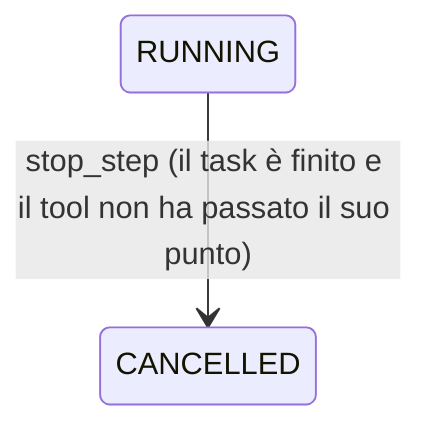

# 0054. Il «ferma» a metà corsa: la fermata arriva al tool prima del suo punto di non ritorno; e il runner della CI con una versione scritta

- **Stato:** **Accettata il 2026-10-02**, quando la prova a mano di `docs/GETTING_STARTED.md` §21 è passata
  sul Mac a `8f9d2c1`, con `scripts/prova_m6_3c.py` (§15) — **con un debito datato**: il passo 8, lo step
  preso dal PC, entro domenica 2026-10-04 (§16). Aperta il 2026-09-30 dal primo commit di M6.3c, che paga il
  debito di ADR 0053 §2 prima della SPEC (decisione 8 della sessione di M6.3c): il primo commit scrive il §1.
  Le sezioni §2–§14 recepiscono la SPEC di M6.3c (`docs/milestones/M6.3c.md`), decisa dal revisore il
  2026-10-01 con le domande 1–17; i numeri di §13 sono la misura del 2026-10-01.
- **Data:** 2026-09-30
- **Riferimenti spec:** §14, §15, §18, §19, §32, §33, §51, §52, §53, §63, §65
- **Milestone:** M6.3c

## Contesto

M6.3c ripara M6.3: un task fermato mentre il suo tool gira fa rispondere `run` con un `409` e lascia lo
step `RUNNING` dentro un task finale (`docs/milestones/M6.3c.md`). Prima di quella riparazione la
milestone paga un debito che non è suo per materia ma lo è per data: **il runner della CI, da fissare
entro il 2026-10-19** (ADR 0053 §2), il giorno in cui `ubuntu-latest` comincia a passare a Ubuntu 26.

Il censimento della SPEC ha trovato il difetto più largo della registrazione: dieci percorsi lasciano uno step
`RUNNING` in un task finale o fanno rispondere `run` con un `409`, un tool non vede nessuna fermata, e la
consegna di un nodo dopo il «ferma» è rifiutata senza che il risultato si scriva. Le sezioni che seguono il §1
sono le decisioni della SPEC.

## Decisione

### 1. Il debito di ADR 0053 §2, saldato: Ubuntu 24.04 scritto nel file, e le azioni su Node.js 24

`.github/workflows/ci.yml` cambia in cinque righe, e ogni riga ha la sua ragione:

| Che cosa | Prima | Dopo | Perché questa |
|---|---|---|---|
| il runner di `make check` su Linux | `ubuntu-latest` | `ubuntu-24.04` | è l'immagine che `ubuntu-latest` risolveva nell'ultima CI verde di `main` prima del pagamento (run `36732243902`, «Image: ubuntu-24.04», versione `20260920.314.1`): fissarla non cambia niente di ciò che la suite ha già visto, compreso il Chrome Headless Shell di ADR 0052 |
| il checkout | `actions/checkout@v4` | `actions/checkout@v7` | l'ultima maggiore (v7.0.1 del 2026-07-20), su `node24`; le sue novità dalla v4 — le credenziali in un file a parte (v6), il checkout di una fork rifiutato per `pull_request_target` e `workflow_run` (v7) — non toccano un workflow che risponde a `push` e `pull_request` |
| la cache del browser | `actions/cache/restore@v4`, `actions/cache/save@v4` | `actions/cache/restore@v6`, `actions/cache/save@v6` | l'ultima maggiore (v6.1.0 del 2026-06-26), su `node24`; la v6 cambia il modulo (ESM), non gli ingressi |
| uv | `astral-sh/setup-uv@v6` | `astral-sh/setup-uv@v10.2.0` | l'ultima versione (2026-09-21), su `node24`. **Dalla v8.0.0 setup-uv non pubblica più tag maggiori**, solo tag completi e immutabili, quindi è l'unica azione fissata a una versione intera. Le due rotture in mezzo non toccano questo file: la v9 non pota più la cache (più spazio di cache, non un comportamento diverso), e la v10 spegne la cache con `enable-cache: auto` su `pull_request_target`, `workflow_run` e `release` — il file dice `enable-cache: true` e non risponde a quegli eventi |

Che ogni azione giri su `node24` è letto dal suo `action.yml` al tag scelto (`runs.using`), non dalle
note di rilascio. `macos-latest` e `windows-latest` restano come sono: non sono di questa decisione (ADR
0053 §1). Ubuntu 26 resta di ADR 0053 §3: si passa quando Playwright lo supporta, misurato, in un commit
che dice perché.

**La prova**: la CI di `92e4d5b` è verde sui tre job (run `36737326073`, 2026-09-30), e le annotazioni dei
job non hanno più gli avvisi di Node.js 20 né quello su `ubuntu-latest` che la CI di `main` a `a7e6ba0` (run
`36732243902`) stampava.

**La difesa girata**: `tests/docs/test_adr_ci_runner.py` affermava il debito com'era; ora afferma che il
runner di Linux è una versione scritta di Ubuntu e che nessuna delle azioni degli avvisi è rimasta. Il
suo caso negativo: un file che rimette l'etichetta che si muove, o una delle azioni vecchie, deve di
nuovo il debito.

### 2. La fermata di un task: un evento per task, alzato dall'engine dopo che la fine è scritta

Il meccanismo di `Ela.stopping` (ADR 0047 §7, ADR 0038 §11) ristretto a un task: un `asyncio.Event` **per
task**, tenuto da `TaskEngine` accanto ai lock per task, **alzato da `_apply_loaded` quando il task entra in uno
stato finale, dopo l'ultima delle sue tre scritture** — la riga, la trail, l'audit —, senza un `await` di ELA
fra l'audit e l'evento. Ogni fine passa di lì, `recover()` compreso. La fermata è un fatto prima di essere un
segnale: l'ordine dell'audit è fisso, e `TASK_CANCELLED` viene prima del `TOOL_EXECUTED` di un tool fermato al
suo punto. Il prezzo: fra la riga e l'audit un tool può passare il suo punto, e allora l'esito dice che ha
agito, ed è vero. Il ramo idempotente non rialza niente. **Solo l'engine la alza**: la regola 58,
`only-the-engine-raises-a-stop` — fuori dall'engine, `stop_signal` si chiama solo per consegnarne il valore alla
fermata di una chiamata, e il modulo di quella fermata non chiama `set`.
L'evento è di un processo: un processo nuovo non ha un tool in volo, e ciò che trova lo chiude il §5.

### 3. Il tool dichiara dove ascolta, in due metà, e ascolta nominando il punto

`ToolPort.stop_point`, **senza default** (il registro rifiuta il silenzio, come per `relocatable`, ADR 0048 §6),
ha due metà: **`here`**, la frase che nomina il punto di non ritorno dove il tool ascolta sul Core, o `None` per
un tool **per cui il punto è la chiamata stessa** (`core.echo`, `fs.read`); e **`on_a_node`**, **la busta** per
un tool che viaggia e `None` per uno che non viaggia — non una promessa d'ascolto: per uno step su un nodo il
punto di non ritorno è l'invio della busta, perché il «ferma» non arriva al nodo. Un test lo deriva
dall'orchestrator e rifiuta, ciascuno con il suo tool finto, un tool che viaggia senza la busta, uno che non
viaggia con un valore, e ogni valore che prometta un ascolto sul nodo.

`ToolPort.execute` riceve **la fermata del suo task come la vede un tool**, con un metodo, `listen(where)`:
solleva `ToolStopped` se il task è fermato; se `where` è il `here` del tool, registra che il tool ha passato il
suo punto. Il punto si nomina perché lo stesso oggetto serve un ascolto che non è il punto — `browser.act`
apre la pagina con lo stesso `open` di `browser.read`, e l'ascolto prima della navigazione ferma la visita senza
dire che `browser.act` ha agito. **La garanzia**: nessun `await` di ELA fra `listen(here)` e la chiamata che
produce l'effetto; ciò che la chiamata fa dentro è oltre il punto. Non si controlla a macchina: è della review.
**La fermata arriva per chiamata, mai per costruzione**: la regola 59, `a-stop-arrives-per-call` — i tipi della
fermata non annotano il parametro di un costruttore né il campo di una classe, e `ela.composition` non li nomina.
**L'executor ascolta prima
di consumare la grant**: un task fermato prima della chiamata non spende il sì e non scrive la `STARTED`.

Port introdotti:

| Port | Spec | Modalità | Membri |
|---|---|---|---|
| `TaskStop` | §65 | sync | `listen`, `is_set`, `stopped` |

**Sincrono, e un modo solo** (ADR 0005 §1): `listen` non deve cedere il loop, e `stopped` consegna
l'awaitable che un lanciatore mette in corsa con il programma. Le implementazioni sono tre: `StopOfTask`
dell'executor, la fermata che non si alza mai del runner del nodo, e `FakeStop` dei test.

| Capability | `here` | `on_a_node` |
|---|---|---|
| `core.echo` | `None` | la busta |
| `workspace.write_note` | `the first write to the disk` | `None` |
| `model.complete` | `the request to the provider` | la busta |
| `perception.capture_screen` | `the capture` | `None` |
| `perception.listen` | `opening the microphone` | `None` |
| `perception.read_screen_text` | `writing the text` | `None` |
| `voice.speak` | `the sound` | la busta |
| `voice.speak_online` | `the request for the synthesis` | la busta |
| `fs.read` | `None` | la busta |
| `fs.write` | `the first write to the disk` | la busta |
| `terminal.run` | `the exec of the program` | `None` |
| `browser.read` | `the navigation` | `None` |
| `browser.act` | `the first gesture` | `None` |

**Dopo il punto** (decisione 5): `terminal.run` ferma il gruppo come per la fermata di ELA (`terminal.stopped`,
con `ended` che nomina la fermata del task), e `browser.act` non fa un gesto dopo il «ferma» (`browser.stopped`
con i gesti fatti). Gli altri tool, dopo il punto, finiscono ciò che l'utente ha approvato, e l'esito lo dice.

### 4. Lo step di un task finito: la regola, `stop_step`, e la riga che ADR 0009 escludeva

**Su un task finito, uno step il cui tool non ha passato il suo punto si chiude `CANCELLED`, qualunque sia il
risultato; uno step il cui tool l'ha passato si chiude come uno step normale.** Per un tool senza `here` il
punto è la chiamata: chiamato e tornato, l'ha passato. Non hanno passato il punto: il tool fermato lì, il tool
fallito da sé prima, i rami che non chiamano il tool (in attesa del sì, il no, il diniego, `tool.refused`, la
grant sparita, il rifiuto sul nodo, l'offerta mai presa, niente nello store). Una `STARTED` senza esito resta
`execution.interrupted` (ADR 0021 §2). L'executor decide dal registro della fermata per la chiamata appena
fatta, e dal risultato per una chiusura che viene dopo un crash: il risultato di un tool con un `here` porta
`metadata["point"]`, `passed` o `not_reached`.

Il tool fermato al suo punto ha un risultato **`ExecutionStatus.CANCELLED`**, con il codice
**`execution.stopped`** scritto dall'executor: il valore del dominio ha finalmente un produttore (ADR 0026 §7).

`STEP_TRANSITIONS` guadagna **`RUNNING → CANCELLED`**; **`stop_step`** lo scrive, con `STEP_CANCELLED`,
idempotente per stato, solo su un task finito e solo dall'executor: la regola 17,
`step-completers`, si estende da `complete_step` a `stop_step`. Il lato e la
riga che questo ADR aggiunge a quelli di ADR 0009 e ADR 0038, letti insieme:

| Operazione | Da | A | Evento della trail | Evento dell'audit | Chiave |
|---|---|---|---|---|---|
| `stop_step` | RUNNING | CANCELLED | `STEP_CANCELLED` | `STEP_CANCELLED` | — |

`fail_step` guadagna un argomento, `stopped_if_ended`: per uno step il cui tool **non ha agito**, in un task
vivo fallisce come sempre, e in un task finito è fermato con quella ragione — deciso sotto il lock del task,
così un «ferma» che cade in mezzo si vede. Le tre chiusure —
`complete_step`, `fail_step`, `stop_step` — valgono anche su un task finito, solo per uno step `RUNNING`, e la
chiusura già applicata resta un no-op. `start_step` e `release_step` vogliono ancora un task `EXECUTING`.
Nessuna classe d'errore nuova: il runner riconosce un task finito rileggendolo.

### 5. Chi chiude: `close_open_step`, sotto il lock del task

Un metodo dell'executor legge gli store come `finish` (ADR 0038 §2) e chiude lo step con la regola del §4: un
risultato → la ripresa; una `STARTED` sola → `execution.interrupted`; un'offerta non presa → il ritiro e
`stop_step`; una presa viva → niente; una presa scaduta → come la scadenza di oggi, ma `stop_step` dove oggi si
rilascia; niente → `stop_step`. **Lo serializza il lock di `run`**, perché l'executor non ne ha uno suo (ADR
0015 §8). I chiamanti: **chi tiene il lock** — un `run`, una consegna, una presa —, che come ultimo atto rilegge
il task e chiude se è finito, senza un `await` fra la rilettura e il rilascio; **la rotta del «ferma»**, dopo
che la fine è scritta, solo se il lock è libero; **la rotta della risposta**, dopo il no; **l'executor**, dopo il
diniego; **la porta di `run`**; e **l'avvio**, dopo `recover()`, per ogni task finito con uno step `RUNNING` —
anche quelli scritti prima di M6.3c (decisione 2 della review). La misura dell'avvio è il §13.

### 6. `run` non solleva mai per un task finito

Ogni scrittura del giro del runner e dell'executor che trova il task finito porta il runner a rileggerlo:
finito → `close_open_step` e l'esito di `OUTCOMES`. Il runner rilegge il task dopo ogni chiamata all'executor;
`execute` e `finish` su un task finito chiudono lo step aperto; `_close` non fallisce un task già finito. Il
`DEVICE_SELECTED` scritto dopo il «ferma» resta, ed è legittimo (ADR 0017 §6.4). **La difesa non è un elenco**:
il test del «ferma» dopo la k-esima scrittura, per ogni k e per ogni piano della sua tabella.

### 7. L'esito: `cancelled`, la sua ragione, e `halt`

`run` ritorna `cancelled`; `steps` comprende lo step in corso quando la chiamata lo chiude (ADR 0051). **La
ragione non è mai vuota**: il sommario dell'evento d'audit della transizione che ha finito il task, passato e
non composto (ADR 0019 §2), e, se la riga d'audit manca, il messaggio dello `STATE_CHANGED` della trail con il
nome dell'operazione. La porta dà la stessa ragione e lo stesso `halt`, perché `OUTCOMES` promette che un task
chiuso prima è riportato come uno chiuso dalla chiamata.

**`halt`** dice che cosa aveva fatto lo step in corso quando il task si è fermato. È una funzione pura della
trail, degli eventi d'audit e della posizione della presa dello step, se un nodo l'aveva presa:

| `halt` | Da che cosa | Riga di comando |
|---|---|---|
| — | nessuno step era in corso | `—` |
| `NOT_ACTED` | chiuso `STEP_CANCELLED` | `had not acted` |
| `ACTED_VERIFIED` | chiuso `STEP_COMPLETED` | `had acted; its verification passed` |
| `ACTED` | chiuso `STEP_FAILED`, codice diverso da `execution.interrupted` | `had acted; its effect was not verified` |
| `UNKNOWN` | chiuso `STEP_FAILED` `execution.interrupted`, o senza la riga d'audit; o aperto con la presa del nodo scaduta | `may have acted: unknown` |
| `FINISHING` | aperto: il tool oltre il punto finisce, o un nodo tiene una presa viva | `still finishing` |

**La frase dice ciò che la verifica ha fatto, mai che l'effetto è avvenuto**: ADR 0047 §9 e ADR 0052 §9 restano
veri. La precisazione B della sessione di M6.3c — «l'effetto è avvenuto lo dice il verifier dove c'è» — **era
sbagliata nella forma, ed è corretta dalla decisione 12 della review**.

### 8. Le superfici: ogni lettore di una rotta che porta lo stato di un task

`halt` sta in `RunOut`, `TaskDetail` e nelle righe di `FinishedOut`. **L'elenco delle viste si deriva**:
ogni rotta il cui modello porta lo stato di un task, e ogni suo lettore — le funzioni dei moduli di pagine che la
chiamano, i comandi della CLI che ne chiedono il percorso, dove un campo annotato `Literal` vale per i suoi valori
e uno che resta `str` per ogni segmento —, in `docs/outcomes.txt`, generato da
`scripts/generate_outcomes.py` e riconfrontato byte per byte dalla suite: **un allarme, non una
dimostrazione**, come l'impronta di ADR 0044 §6. Un lettore nuovo ferma `make check`, e la risposta — la resa di
`halt` con il suo test, o la riga che dice perché no — si scrive nel documento della milestone. Il telefono
mostra `halt` sotto ogni tetto: è un fatto dell'esecuzione, come lo stato, non del contenuto. Le due conferme
del «ferma» non dicono più «il task non farà più niente».

### 9. Il nodo: il punto è la busta

Un'offerta non presa si **ritira** con un'operazione nuova del port delle assegnazioni, condizionata su
`OFFERED`, in uno stato nuovo, **`AssignmentState.WITHDRAWN`** (`expire` scrive `EXPIRED` solo dove il tempo ha
deciso). La presa di un'offerta il cui task è finito la ritira lei e chiude lo step, e la richiesta di lavoro
del nodo passa all'offerta successiva, o risponde «niente lavoro». **Dopo la presa** la consegna è accettata per uno step `RUNNING` di un task
finito, e lo chiude con la regola del §4; il rinnovo di quella presa salta il battito del task invece di
sollevare. **Una presa scaduta di un task finito** vuol dire che nessuno sta eseguendo lo step: `halt` dice
`UNKNOWN`, mai `FINISHING`, e lo step si chiude al primo avvio o al primo `run` di quel task — niente chiusure
nella richiesta di lavoro di un nodo per task che non sono suoi, e nessun giro periodico nuovo. **Far viaggiare
la fermata fino al nodo** è della prima fra M13.11 e M13.7 che si apre, o della sua SPEC che dice perché no;
lì `on_a_node` guadagna il suo secondo valore.

### 10. Il lock: il «ferma» non lo prende per fermare, lo prende per chiudere

Il «ferma» non prende il lock per fermare — è ciò che gli permette di arrivare a un tool che gira —, e lo prende
per chiudere. **Il «mai 409» vale per ogni titolare del lock**: il `run` di un task fermato che trova il lock
preso, da un altro `run`, da una consegna, da una presa o dalla chiusura del «ferma», risponde dalla porta
senza chiudere niente. Due `run` di un task vivo ricevono ancora `409 already_running`.

### 11. Il debito di ADR 0052 §15, saldato: il «ferma» a metà di uno step del browser

`tests/api/test_browser_stopped_midway.py` si gira, e i suoi tre test dicono i tre lati del punto di non ritorno
di `browser.act`, attraverso l'API e con il browser finto che trattiene l'istante che serve:

- `test_a_browser_step_stopped_after_its_first_gesture_closes_as_a_normal_one` — il caso del debito, girato:
  il click è in corso, oltre il punto; parte, il verifier guarda, lo step è `COMPLETED`, e `run` risponde
  `200 cancelled` con le parole del «ferma» e `halt` `ACTED_VERIFIED`;
- `test_a_browser_step_stopped_before_the_navigation_visits_nothing` — il «ferma» mentre il browser parte: il
  sito non vede niente, nessun gesto, il risultato `CANCELLED` con `execution.stopped`, `NOT_ACTED`;
- `test_a_browser_step_stopped_before_its_first_gesture_fills_nothing_and_closes_the_page` — il punto della
  decisione 2: la pagina è aperta e gli elementi si stanno guardando; nessun campo, nessun click, e la pagina
  si chiude.

### 12. Le eccezioni della decisione 1, scritte apertamente

La decisione 1 della sessione — «nessuno step resta `RUNNING` dentro un task finale» — **alla lettera è falsa**
per tre step, e si corregge qui invece di aggirarla (decisioni 13 e 15 della review): lo step di un tool sul
Core oltre il punto che non è ancora tornato; quello di un nodo con la presa viva; e quello di una presa scaduta
fino al primo avvio o al primo `run` del task. Il test della decisione 1 nomina le tre, e nient'altro.

### 13. La misura dell'avvio

La decisione 2 della review: si misura su una copia del database vero del Mac quanti task finiti l'avvio legge,
quanti ne chiude e quanto impiega. **Misurata il 2026-10-01**, a `6adec5b` più il lavoro di M6.3c non ancora
committato, su una copia di `~/.ela/ela.db` fatta con l'API di backup di sqlite da una connessione in sola
lettura, con ELA costruita come la costruisce `ela serve` e il solo `ELA_DB_URL` sulla copia; il tempo misurato
dentro il giro, con `perf_counter`, per ciascuna chiamata. L'uscita intera è in
`~/Downloads/m6.3c-misura-avvio.txt`.

| | |
|---|---|
| task nel database | 92: 61 `COMPLETED`, 18 `FAILED`, 6 `DENIED`, 4 `CANCELLED`, 2 `QUEUED`, 1 `CREATED` |
| task finiti, e con un piano | 89, e 88: **letti** |
| step `RUNNING` in un task finito | **8**, tutti scritti prima di M6.3c: **chiusi** |
| `recover()` | niente da fare, 0,7 ms |
| `close_every_open_step()`, primo avvio | **160 ms** |
| i due avvii dopo | 114 ms ciascuno, 0 chiusi |

**Gli otto, e come si sono chiusi**: sei sono il no dell'utente, che lasciava `RUNNING` lo step che aveva chiesto
— `CANCELLED`, «the task ended before the tool of this step acted», senza risultati; uno è uno step di
`voice.speak` su un nodo, con la sola `STARTED` della presa e il task `FAILED` — `FAILED` con
`execution.interrupted`; e uno è **il difetto del §15 di ADR 0052**, il task del passo 6 di §20: il `browser.act`
del modulo aveva finito `SUCCEEDED` dopo il «ferma» — la ripresa lo verifica e lo chiude `COMPLETED`, e `halt`
dice `ACTED_VERIFIED`. L'effetto compiuto resta scritto, su un dato vero.

**Il costo** cresce con la storia, linearmente: circa 1,3 ms per task finito con un piano, la lettura della trail e
del piano di ciascuno. A 88 task non pesa, e nessun filtro si propone (decisione 2: «se la misura dice che pesa,
il riepilogo propone un filtro, non prima»).

### 14. Righe riviste

- **ADR 0009**: la tabella degli step guadagna `RUNNING → CANCELLED`, e la ragione che lo escludeva resta vera
  della sola cascata; in §3, «ogni operazione di step su un task non EXECUTING è rifiutata» vale ora per
  `start_step` e `release_step`, e «il risultato di un nodo dopo un cancel non viene registrato» non vale più
  per uno step preso prima del «ferma».
- **ADR 0019 §10**: la riga `CANCELLED` esce anche dal ciclo, non solo dalla porta.
- **ADR 0023 §9**: la cancellazione non prende il lock per fermare, per scelta; lo prende per chiudere (§10).
- **ADR 0038 §12 e §13**: la consegna e il rinnovo per uno step di un task finito, preso prima del «ferma» (§9).
- **ADR 0052 §18**: il `reason` vuoto di `cancelled` alla porta **non era di M13.1c**, che esclude `cancelled`
  (le sue quattro ragioni sono di `denied` e `failed`): ADR 0052 §18 sbagliava a darglielo, e da M6.3c quel
  vuoto non c'è più (§7).
- **La precisazione B** della sessione di M6.3c, corretta dalla decisione 12 della review (§7).

### 15. La prova a mano, passata sul Mac il 2026-10-02

Tommaso, a `8f9d2c1`, con lo script, in due giri: **`~/Downloads/prova-m6.3c-20261002-101840.txt`** e
**`~/Downloads/prova-m6.3c-20261002-102354.txt`**.

- **Passi 2, 3 e 4 — il «ferma» che arriva al tool**: `browser.read` fermato prima della navigazione,
  `browser.act` prima del primo gesto, `terminal.run` dopo l'`exec`, con il gruppo fermato e nessun `sleep 97`
  rimasto vivo. **PASSATO al primo giro in tutti e due i file**: il lato del «ferma» e ogni uscita attesa.
- **Passi 5 e 6 — le conferme nuove e il «ferma» dalle due pagine**: PASSATO al primo giro nel secondo file.
  Nel primo, FALLITO **non per ELA**: la conferma letta, «Ferma il task» non premuto — l'audit di `fce07aca` non
  ha nessuna riga di fermata fra `TASK_QUEUED` e il `run` dello script —; da allora lo script verifica il
  «ferma» di Tommaso invece di aspettare un Invio. Il «no» alla prima domanda del passo 5 nel secondo file è un
  Invio vuoto, e da allora una risposta vuota si richiede.
- **Passo 8 — lo step preso dal PC**: FALLITO in tutti e due i file, con il PC spento: lo step è girato sul
  Mac, e lo script l'ha visto senza ripetere. È il debito del §16.

**Nessun difetto del codice di ELA.** Le correzioni sono dello script e della guida, nella SPEC di M6.3c («La
review della prova, recepita»).

### 16. Un debito datato: il passo 8 della prova a mano, entro domenica 2026-10-04

**Debito a carico del giro di domenica della prova di M6.3c, su `main`**, dichiarato il **2026-10-02**, dalla
review della prova a mano (correzione 5).

Il passo 8 di §21 — uno step preso dal PC, fermato dopo la busta, che il PC finisce e consegna e che si chiude
come uno step normale — non si è potuto fare: il PC non è disponibile fino a **domenica 2026-10-04**. Ciò che
prova non è nella suite: la suite prova la consegna dopo il «ferma» con le rotte vere e un nodo che parla
attraverso di esse dallo stesso processo (`tests/api/test_nodes_work.py`), non con due processi su due macchine.

**Si paga così**: dopo il merge, con il Mac e il PC su `main` (§21 passo 7), Tommaso fa girare lo script
intero, una volta, e **il debito è saldato da un file che dice «La prova è passata»**. Se il passo 8 fallisce,
si apre una riparazione con la sua lettera. `bin/sleep` resta nel `.env` di Tommaso fino a quel giro.

## Alternative considerate

- **Fissare le azioni al loro commit, come setup-uv suggerisce.** Scartata qui: è una scelta di catena di
  fornitura che vale per tutte le azioni del file, non per una, e il debito non la chiede. Il file le
  fissa tutte a un tag.
- **La maggiore più bassa su `node24`** (checkout v5, cache v5). Scartata: il debito chiede le azioni
  aggiornate, e l'ultima maggiore è quella che riceve le correzioni.
- **`ubuntu-22.04`.** Scartata: la suite non ci ha mai girato, e fissare il sistema che si sta già usando
  è l'unica scelta che non cambia niente.

## Conseguenze

Port estesi:

| Port | Spec | Modalità | Membri |
|---|---|---|---|
| `ToolPort` | §27, §65 | async | `stop_point` |
| `AssignmentStore` | §15, §65 | async | `withdraw` |

E le firme che cambiano senza un membro nuovo: `ToolPort.execute` riceve la fermata del task,
`Browser.open` anche, e `CommandLauncher.run` la mette in corsa con il programma.

Con questo ADR le regole di architettura sono **cinquantanove** (la 58 e la 59, e la 17 estesa), i port
**trenta** (`TaskStop`), le rotte dell'API restano **quarantanove** e i comandi della CLI **ventisette**: nessuna
rotta e nessun comando nuovi — `halt` è un campo delle risposte che c'erano.

- Il nome del job diventa `make check (ubuntu-24.04)`. `main` non ha una protezione di branch
  (`gh api repos/{owner}/{repo}/branches/main/protection` risponde 404, il 2026-09-30), quindi nessun
  controllo richiesto porta il nome vecchio.
- I documenti delle milestone passate che dicono `ubuntu-latest` descrivono la CI del loro tempo, e non
  si riscrivono.
- La tabella dei debiti di `docs/STATO.md` legge il pagamento da questo ADR: ADR 0053 §2 passa a
  «saldato da ADR 0054 §1».
